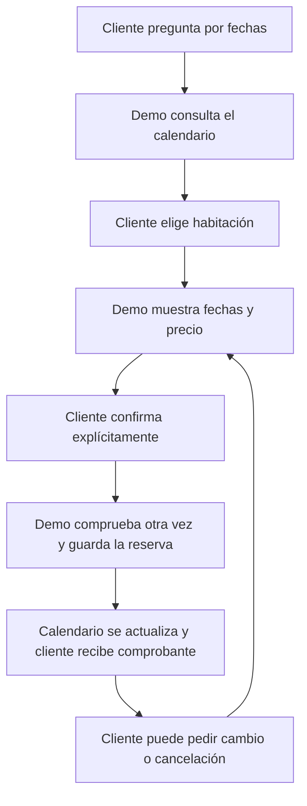
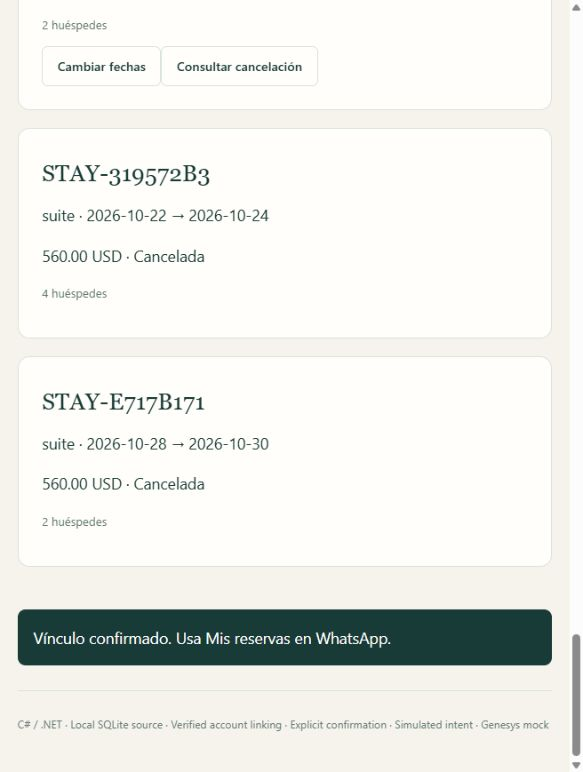
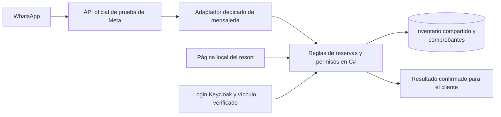

# ContactCenterAI

### Un resort ficticio que puedes reservar desde WhatsApp

[English](README.md) · [Probar la demo](docs/resort-demo.es.md) · [Cómo funciona](docs/es/como-funciona.md) · [Arquitectura](docs/resort-booking-v0.12.es.md)

Pregunta por fechas disponibles, compara habitaciones y confirma una estadía ficticia desde el chat. Después puedes cambiar las fechas o cancelar. El calendario web consulta el mismo inventario y refleja cada operación confirmada.

Este **proyecto de portafolio en C# / .NET** conecta una conversación con una operación de negocio confiable. El transporte de WhatsApp y el inicio de sesión son reales. El hotel, las tarifas y las reservas son ficticios. No hay pagos.

## El recorrido del cliente



**Pedir una propuesta y confirmar son pasos distintos.** La propuesta dura cinco minutos y no aparta la habitación. Al confirmar, el servidor vuelve a comprobar disponibilidad, precio y permisos.

<details>
<summary><strong>Ver el resort y su calendario</strong></summary>


Captura del recorrido del 2026-10-06, después de crear una estadía en Suite. Más adelante cambiamos las fechas y cancelamos esa reserva.



</details>

## Qué puede hacer

| Solicitud del cliente | Respuesta de la demo |
|---|---|
| «¿Qué incluye la Suite?» | Consulta amenidades, capacidad y tarifa del catálogo |
| «Dame las fechas disponibles» | Consulta inventario vigente, incluidas noches ocupadas o en mantenimiento |
| «Reservar Suite para dos personas» | Prepara una propuesta con fechas completas y total ficticio |
| «Confirmar …» | Valida la propuesta y registra la operación una sola vez |
| «Mis reservas» | Muestra las estadías de la cuenta vinculada |
| «Cambiar mis fechas» | Conserva la reserva anterior hasta confirmar el cambio con éxito |
| «Cancelar mi reserva» | Comprueba la política, pide confirmación y libera las noches |
| `/en`, `/es`, `/human` | Cambia el idioma o pausa el bot para una cola humana simulada |

Las operaciones privadas requieren login y un vínculo temporal de cuenta. Tener un teléfono o conocer un código de reserva no permite acceder a la estadía de otro cliente.

## El hotel ficticio

| Habitación | Huéspedes | USD por noche | Amenidades incluidas |
|---|---:|---:|---|
| Estándar | 2 | 120 | Wi-Fi, desayuno, aire acondicionado |
| Deluxe | 2 | 180 | Wi-Fi, desayuno, balcón, vista a piscina |
| Suite | 4 | 280 | Amenidades de Deluxe, jacuzzi privado, terraza |

Una unidad por categoría. Estadías de 1 a 14 noches dentro de los próximos 90 días. Dos noches en Suite cuestan **560 USD ficticios**. Cambios y cancelaciones exigen al menos 72 horas antes de la llegada actual.

## Cómo funciona por dentro



Solo el host de mensajería utiliza un túnel HTTPS temporal. El login web, la administración y las rutas internas permanecen locales. La [guía de arquitectura](docs/resort-booking-v0.12.es.md) explica estos límites y la recuperación.

| Área de ingeniería | Implementación actual |
|---|---|
| Backend | ASP.NET Core sobre .NET 10, capas en C# y contratos de integración explícitos |
| Identidad | Keycloak Authorization Code + PKCE, roles, propiedad y sesiones con vencimiento |
| Calendario | SQLite relacional con una asignación única por habitación/noche |
| Operaciones confiables | Propuestas que vencen, confirmación explícita, cambios atómicos y comprobantes persistentes |
| Duplicados/reinicios | El mismo ID de comando devuelve su resultado guardado; el trabajo en cola puede recuperarse |
| Canales | WhatsApp oficial real de prueba; adaptador de Telegram presente, sin bot real configurado |
| IA y conocimiento | Resort con intenciones deterministas acotadas; perfil separado de Qwen/BGE-M3 local y conocimiento aprobado ES/EN con citas |
| Evaluación | Herramientas offline en Python, comprobaciones C# e inferencias conservadas |
| Operación | Auditoría y trazas sanitizadas, panel local y evidencia histórica de copia/restauración |

Precios y fechas salen de datos estructurados. Los permisos y los cambios críticos de estado los decide C#.

## Evidencia y límites

El **2026-10-06**, el dueño completó por WhatsApp real disponibilidad, vínculo de cuenta, reserva, cambio, cancelación y consulta de reservas propias. El navegador mostró los mismos cambios. Creación y cambio respondieron en español. También comprobamos cancelación y reservas propias en inglés. [Recorrido registrado](docs/progress/resort-whatsapp-2026-10-06.json).

- **402 comprobaciones deterministas combinadas:** 332 de regresión original y 70 del resort, con concurrencia, rollback, recuperación y límites de permisos.
- **28/28 ejemplos declarados del parser:** frases conocidas ES/EN, sin afirmar comprensión libre de cualquier conversación.
- **Evaluación de IA local:** 300 respuestas originales de retrieval. Una repetición puntual combina 13 comprobaciones actuales con 287 respuestas cuyo recorrido no cambió. Quedan ocho errores de calidad visibles. [Resultados y límites](docs/es/evaluacion-y-limites.md).

La atención humana y Genesys Cloud siguen simulados. Telegram aún no tiene bot real. SQL Server para el producto, Qdrant, Angular, revisión independiente y CI remoto son objetivos pendientes. Existe el workflow de GitHub Actions, sin afirmar que pasó una ejecución remota. Es una demo local de portafolio.

## Probar y explorar

Después de la [preparación inicial](docs/es/primeros-pasos.md), abre Docker Desktop y ejecuta:

```powershell
.\eng\Start-Resort.cmd
```

Abre `http://127.0.0.1:7452/resort.html`. Las cuentas ficticias `customer-a`, `customer-b` y `operations-admin` usan `123456Aa!`. Las claves de servicios permanecen en archivos locales excluidos de Git. WhatsApp requiere tu propia configuración de Meta y un túnel activo. Publicar código en GitHub no mantiene el bot encendido.

| Si quieres… | Lee esto |
|---|---|
| Entenderlo sin saber informática | [Explicación sencilla](docs/es/como-funciona.md) |
| Repetir el recorrido del resort | [Instrucciones de demo](docs/resort-demo.es.md) |
| Revisar reglas y diagramas | [Arquitectura del resort](docs/resort-booking-v0.12.es.md) |
| Explorar el perfil original de IA local y RAG | [Guía de ingeniería](docs/es/guia-ingenieria.md) |
| Conectar los canales | [Preparación de WhatsApp y Telegram](docs/integrations/setup.es.md) |
| Explicarlo en una entrevista | [Guía de portafolio](docs/es/portafolio.md) |
| Consultar requisitos, decisiones e historial | [Índice de documentación](docs/README.md) |

Proyecto de aprendizaje y portafolio desarrollado con herramientas asistidas por IA. Documentamos decisiones, evidencia y límites. Bases, modelos, tokens, códigos de vínculo, copias y logs privados quedan fuera de Git. [Avisos de terceros](THIRD_PARTY_NOTICES.md).
