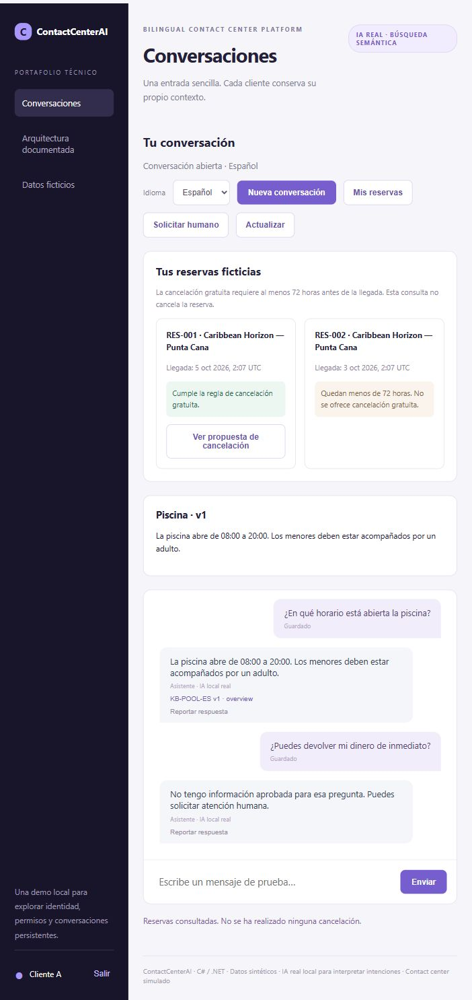
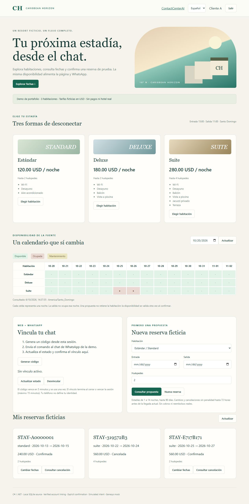

# ContactCenterAI

[Español](README.es.md) · [Run it](docs/en/getting-started.md) · [Architecture](docs/en/engineering-guide.md) · [WhatsApp + Telegram](docs/integrations/channels.en.md)

A small contact-center demo built in **C# / .NET 10**. It answers questions in English and Spanish, reads fictional reservations, prepares a cancellation for review, and hands a conversation to a simulated human queue.

The useful part is what happens around the model: the server checks permissions, asks for explicit confirmation, records the operation, and waits for the reservation service to confirm the result. The model cannot cancel a reservation by itself.

## Resort + WhatsApp · v0.12

Three fictional rooms: Standard ($120/night), Deluxe ($180/night) and Suite ($280/night, private jacuzzi). The web calendar and WhatsApp read the same live local inventory. Sign in, link your chat, then request a booking, a date change or a cancellation. Each action needs an expiring quote and explicit confirmation. No payments.

[Try the resort](docs/resort-demo.en.md) · [Architecture and flows](docs/resort-booking-v0.12.en.md) · [Current evidence](docs/progress/resort-v0.12.md)

This resort flow uses a bounded deterministic parser. The local Qwen/RAG profile remains available separately; paid token APIs are not required. On 2026-10-06, real WhatsApp availability, booking, date change and cancellation matched the web calendar, with private responses in Spanish and English. The [recorded walkthrough](docs/progress/resort-whatsapp-2026-10-06.json) covers this demo route; broader provider/security validation and remote CI remain separate.

## A five-minute walkthrough

1. Ask when the pool opens. Open the document cited in the answer.
2. Sign in as a fictional customer and view their reservations.
3. Request a cancellation. The reservation stays unchanged until you press Confirm.
4. Show a lost response: the system checks the original command instead of creating a second cancellation.
5. Request a human. The bot pauses and only the assigned agent can open the case.

[English demo script](docs/en/demo.md) · [Guion en español](DEMO.md)

## What is working

| Area | Current demo |
|---|---|
| Backend | ASP.NET Core, Application / Domain / Infrastructure layers; Python for offline evaluation |
| Identity | Real local Keycloak login with Authorization Code + PKCE, persistent sessions, roles and resource checks |
| Reservations | Separate HTTP service with its own SQLite database; synthetic inventory |
| Reliable actions | Expiring offers, explicit confirmation, durable commands, leases, source receipts and reconciliation |
| Local AI | Pinned Qwen intent model, BGE-M3 embeddings and a closed evidence selector; no paid inference API |
| Knowledge | 40 logical documents / 80 ES/EN variants, publication review, access filters, expiry and citation checks |
| Human transfer | Provider-neutral interface and a local mock; request IDs and ownership epochs prevent stale acknowledgments |
| Operations | Small local operations panel, sanitized traces and a recorded backup/restore exercise |
| Delivery | Locked dependencies, a GitHub Actions workflow and 249 deterministic checks in the v0.10 baseline |

WhatsApp uses the official Cloud API test resource; real ES/EN policy replies reached Read in the historical v0.11 evidence. Telegram adapter code is present but its live bot is not configured. The v0.12 linked booking extension is documented above. [Messaging setup](docs/integrations/setup.en.md).

## What the measurements mean

The [evaluation guide](docs/en/evaluation-and-limits.md) explains the results and keeps the failures visible. There are 300 original local retrieval outputs. A later, narrowly scoped replay combines 13 current scope checks with 287 unchanged outputs: 97% and 98% exact results on two known sets, and abstention on all 60 out-of-scope cases. **Eight quality errors remain.** This is not a fresh 300-call run, a load test, or an independent review.

The demo uses SQLite and plain JavaScript. SQL Server, Qdrant, Angular and a live Genesys Cloud tenant are enterprise targets with open gates. Encrypted SQL product connectivity remains blocked on the original Windows host. No production-readiness claim is made.

## Start here

- [Setup on a new computer](docs/en/getting-started.md)
- [How the system works](docs/en/engineering-guide.md)
- [What this demonstrates for an AI Agent Developer role](docs/en/portfolio.md)
- [Messaging integration design](docs/integrations/channels.en.md)
- [Connect Telegram and WhatsApp from scratch](docs/integrations/setup.en.md)
- [Requirements, decisions and historical evidence](docs/README.md)
- [Third-party notices](THIRD_PARTY_NOTICES.md)

Everything is fictional: hotel, accounts, policies and reservations. Demo users share `123456Aa!`; service credentials are generated locally and excluded from Git. Model weights, databases, backups and runtime logs are also excluded.

This is a learning and portfolio project developed with AI-assisted tooling. The documentation explains the choices, tests and limitations so they can be discussed and reproduced.
