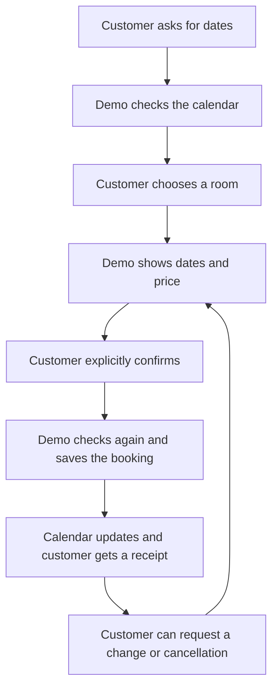
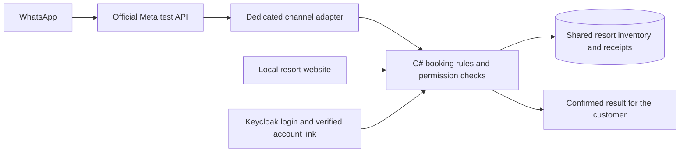

# ContactCenterAI

### A fictional resort you can book through WhatsApp

[Español](README.es.md) · [Try the demo](docs/resort-demo.en.md) · [How it works](docs/en/how-it-works.md) · [Architecture](docs/resort-booking-v0.12.en.md)

Ask for available dates, compare rooms, and confirm a fictional stay from a chat. You can then change the dates or cancel. The web calendar reads the same inventory and reflects each confirmed action.

This **C# / .NET portfolio project** connects a conversation to a reliable business operation. WhatsApp transport and login are real. The hotel, prices and reservations are fictional. There are no payments.

## The customer journey



**Asking and confirming are separate steps.** A proposal lasts five minutes and does not hold a room. The server checks availability, price and permissions again when the customer confirms.

<details>
<summary><strong>See the resort and calendar</strong></summary>


Screenshot from the 2026-10-06 walkthrough, after creating a Suite stay. Later steps changed and cancelled it.


</details>

## What you can do

| Customer request | What the demo does |
|---|---|
| “What does the Suite include?” | Reads amenities, capacity and price from the catalog |
| “Show available dates” | Checks current inventory, including occupied and maintenance nights |
| “Book a Suite for two guests” | Prepares a proposal with complete dates and a fictional total |
| “Confirm …” | Checks the proposal and records the operation once |
| “My bookings” | Shows only the bookings owned by the linked account |
| “Change my dates” | Keeps the old booking until confirmation of the change succeeds |
| “Cancel my booking” | Checks the rule, asks for confirmation and releases the nights |
| `/en`, `/es`, `/human` | Changes language or pauses the bot for a simulated human queue |

Private actions require login and a temporary account link. A phone number or booking reference cannot grant access to another customer's stay.

## The fictional property

| Room | Guests | USD per night | Included amenities |
|---|---:|---:|---|
| Standard | 2 | 120 | Wi-Fi, breakfast, air conditioning |
| Deluxe | 2 | 180 | Wi-Fi, breakfast, balcony, pool view |
| Suite | 4 | 280 | Deluxe amenities, private jacuzzi, terrace |

One room per category. Stays last 1–14 nights within a 90-day horizon. Two nights in a Suite cost **560 fictional USD**. Changes and cancellations use a 72-hour cutoff before the current arrival.

## Under the hood



Only the channel host uses a temporary HTTPS tunnel. Web login, administration and internal booking endpoints stay local. See the [architecture guide](docs/resort-booking-v0.12.en.md) for these boundaries and recovery.

| Engineering area | Current implementation |
|---|---|
| Backend | ASP.NET Core on .NET 10, layered C# and explicit integration contracts |
| Identity | Keycloak Authorization Code + PKCE, roles, ownership checks and expiring sessions |
| Calendar | Relational SQLite with one unique allocation per room/night |
| Reliable actions | Expiring proposals, explicit confirmation, atomic changes and durable receipts |
| Duplicates/restarts | Same command ID returns its recorded result; queued work can recover |
| Channels | Real official WhatsApp test transport; Telegram adapter present, live bot not configured |
| AI and knowledge | Bounded deterministic resort intents; separate local Qwen/BGE-M3 retrieval profile with approved ES/EN knowledge and citations |
| Evaluation | Python offline tooling, deterministic C# checks and preserved inference results |
| Operations | Sanitized audit/traces, local operations UI and historical backup/restore evidence |

Prices and dates come from structured data. Critical permissions and state changes remain in C#.

## Evidence and honest limits

On **2026-10-06**, the owner completed availability, account linking, booking, date change, cancellation and own-booking queries through real WhatsApp. The browser showed matching calendar changes. Creation/change replies were Spanish; cancellation and own-booking replies were also checked in English. [Recorded walkthrough](docs/progress/resort-whatsapp-2026-10-06.json).

- **402 combined deterministic checks:** 332 original regression checks plus 70 resort checks, covering concurrency, rollback, recovery and permission boundaries.
- **28/28 declared parser examples:** known ES/EN examples, not unrestricted language understanding.
- **Local AI evaluation:** 300 original retrieval outputs. A scoped replay combines 13 current checks with 287 unchanged outputs. Eight quality errors remain. [Results and limits](docs/en/evaluation-and-limits.md).

Human transfer and Genesys Cloud remain mocked. Telegram has no live bot configured. SQL Server product connectivity, Qdrant, Angular, independent review and remote CI remain open targets. A GitHub Actions workflow exists, without a claimed successful remote run. This is a local portfolio demo.

## Run and explore

After the [initial setup](docs/en/getting-started.md), start Docker Desktop and run:

```powershell
.\eng\Start-Resort.cmd
```

Open `http://127.0.0.1:7452/resort.html`. Synthetic users `customer-a`, `customer-b` and `operations-admin` use `123456Aa!`. Service credentials stay in ignored local files. WhatsApp requires your own Meta test setup and an active tunnel. Publishing the code on GitHub does not keep the bot running.

| If you want to… | Read this |
|---|---|
| Understand it without a software background | [Plain-language explanation](docs/en/how-it-works.md) |
| Reproduce the resort walkthrough | [Demo instructions](docs/resort-demo.en.md) |
| Review booking rules and diagrams | [Resort architecture](docs/resort-booking-v0.12.en.md) |
| Inspect the original local AI/RAG system | [Engineering guide](docs/en/engineering-guide.md) |
| Connect messaging channels | [WhatsApp and Telegram setup](docs/integrations/setup.en.md) |
| Discuss it in an interview | [Portfolio guide](docs/en/portfolio.md) |
| Review requirements, ADRs and historical evidence | [Documentation index](docs/README.md) |

Learning and portfolio project developed with AI-assisted tooling. Decisions, evidence and limitations are documented for review. Databases, model weights, tokens, account-link codes, backups and private logs stay out of Git. [Third-party notices](THIRD_PARTY_NOTICES.md).
