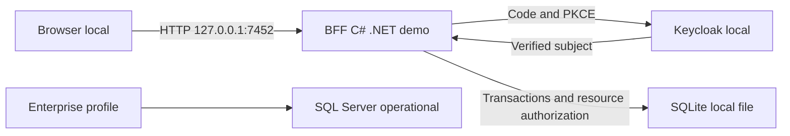

# Architecture Freeze v0.2 — Perfil de presentación

Estado: **CLOSED — diseño local autorizado por simplificación solicitada por el usuario**. Baseline v0.1 preservada para el objetivo empresarial. Solo modifica el transporte/almacenamiento del perfil demo, según ADR-014.

Demo: browser → HTTP loopback 7452 / BFF .NET → Keycloak local Code+PKCE → sesión/MemberRef servidor → SQLite persistente. UI mínima en el mismo origen. Usuarios ficticios A/B y empleados con contraseña común pública. Sin gestión de certificados por el usuario.

Conserva invariantes: autenticación fuera del chat; tenant/propiedad/asignación servidor; CSRF+Origin; DTO cerrado; transacción antes de 201/202; idempotencia/versionado; ningún éxito empresarial inferido del modelo. C# backend y Python offline. SQL Server y sus evidencias permanecen como perfil empresarial. No convierte resultados SQLite en pruebas SQL Server.

Entrega y resultados: [presentación local](progress/demo-local.md), [contrato demo](contracts/demo-v0.2.openapi.json). CLOSED describe el diseño previo a implementación; no implica que el recorrido de navegador ni todos los slices de IA estén verificados.

DoR del perfil: FR01/03/04/09/18, AC04–06/14/28/30, ADR-014, contratos de sesiones/conversaciones existentes con override de origen/transporte documentado. Casos de UI/auth/durabilidad y bloqueo remoto definidos en ADR. Dependencias C# oficiales pin/hash; implementación tras este registro. Threat model: clave común y HTTP no son aplicables a cuentas/datos reales; bind loopback/Host fijo/Origin/CSRF obligatorios. Gates de presentación: login real, guardar/reabrir conversación, aislamiento A/B y arranque de un clic. Worker/IA/RAG/reservas siguen sus slices, no se declaran implementados por añadir login.

