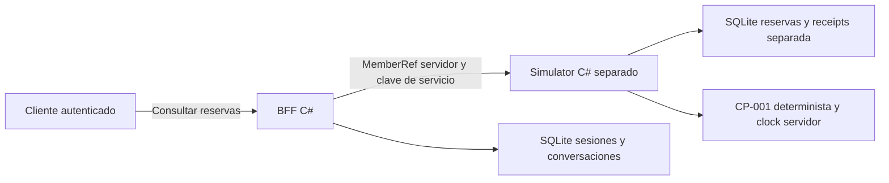

# Architecture Freeze v0.3 — Fuente de presentación

Estado: **CLOSED — diseño previo al código B05**. Extiende la excepción sintética de v0.2 al almacenamiento fuente. Arquitectura objetivo v0.1 conserva SQL Server y fuentes externas.

DoR: FR05/08, AC11–14 en fuente; CP-001 v1, ADR-002/003/007/014/015, contrato de comandos fuente existente. C# principal, Python offline. Dos procesos/DB, adapter HTTP, sesión/member servidor, clave de servicio automática y autorización fuente. UI read-only de reservas/elegibilidad; cancelación autenticada del producto depende de B06/B07. No LLM ni éxito por preview.

Read: GET fuente `/source/reservations`, `/source/reservations/{id}`; GET producto `/v1/conversations/{id}/reservations`. Mutation interna fuente: POST `/source/commands/cancel` con commandId, reservationId, expectedReservationVersion, policyVersion; GET `/source/commands/{id}` para receipt. Fuente usa su clock; ninguna fecha del request sustituye now. Identidad delegada exige clave de servicio y MemberRef servidor. Error 404 genérico para recurso ausente/ajeno; 409 payload/versión/política; 422 fuera de regla. El producto no expone POST de cancelación en este slice.

Riesgos/gates: auth del servicio loopback sintético, source outage/timeouts, contaminación de DB, replay, version conflict. No claims de SQL Server, tenant real, cancelación end-to-end, leases o calidad IA por completar esta fuente. Evidencia B05 debe separar regla/repositorio/HTTP/UI.
