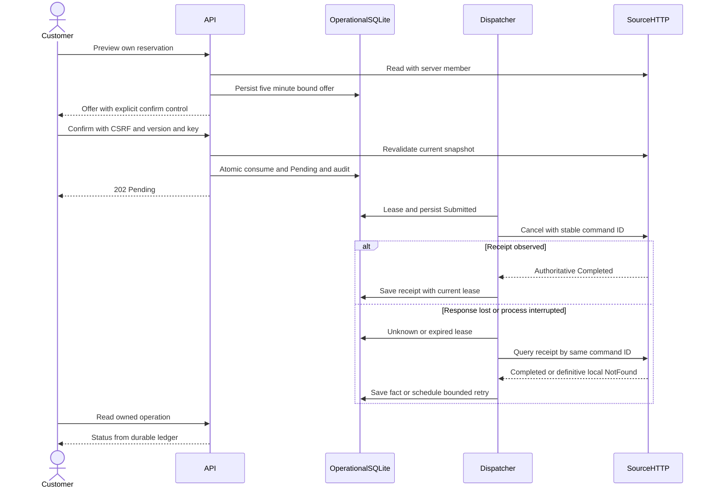

# Architecture Freeze v0.4 — Transacciones de la demo

Estado: **CLOSED antes de implementación**, 2026-10-01 UTC. Refinamiento local autorizado por la petición de continuar y terminar una presentación sencilla. No cambia la autoridad del LLM ni los gates empresariales v0.1.

## Scope y Definition of Ready

B06/B07 en perfil demo: preview, rechazo, confirmación propia, consumo único, comando durable, dispatcher con leases, Unknown/reconciliation y kill switch. Criterios AC07–16/31, restricciones INV01–04/07 y [ADR-016](adr/016-local-durable-transactions.md) cerrados. Validación: ofertas vencidas/alteradas/ajenas, replays, concurrencia, source commit con respuesta perdida, restart, principal revocado y kill switch. Cada prueba usa DB aislada y reloj controlado; la UI prueba una reserva ficticia propia. No requiere secreto nuevo, proveedor de IA ni certificados.

## Contrato local

- POST `/v1/conversations/{id}/cancellation-offers`: `{reservationId}`, If-Match conversación. Devuelve 201 oferta con versión de conversación nueva, consecuencias, reserva, policyVersion y expiry; no cancela.
- POST `/v1/conversations/{id}/confirmations`: `{offerId,decision}` (confirm/reject), If-Match offer/conversation version, Idempotency-Key. Devuelve 202 Pending/operationId durable o 200 Rejected. Replay idéntico devuelve mismo resultado; payload distinto 409.
- GET `/v1/conversations/{id}/actions`: ofertas y operaciones visibles para propietario; no MemberRef ni claves.
- GET `/v1/operations/{id}`: lectura por propietario; ajeno o inexistente 404.
- Puerto interno de fuente: POST cancel y GET receipt con commandId estable, server MemberRef, expected source version y CP-001:v1.

La API revalida fuente antes de consumir. Dispatcher revalida binding/rol y policy por fuente. Error antes del envío puede ser Rejected/Conflict; error después del envío es Unknown. UI solo muestra «cancelada» para Completed con receipt fuente validado. Persistir intención, consumo y audit es una sola transacción; resultados actualizan el ledger por leaseId vigente. Rechazar no toca la fuente.

## Modelo conceptual local

Offer pertenece a Conversation y Principal; almacena epoch/version y snapshot de consecuencias. Confirmation tiene principal, keyHash, payloadHash y offerId único. BusinessCommand tiene commandId, offerId único, member/tenant servidor, payload inmutable, status, leaseId/until, attempts, nextAttempt, submittedAt, humanReview y receipt final. Audit registra códigos, IDs y reloj, sin chat ni credenciales. Las tablas existentes no se sustituyen y los datos previos se preservan.

Threat review: oferta falsificada/IDOR/replay/CSRF/TOCTOU y doble dispatch se bloquean por ownership, DTO cerrado, key/payload hash, version/epoch/clock y fuente CAS/dedupe. Timeout no se convierte en éxito. Source key no sale al navegador. Source adapter no acepta URL del cliente/modelo.
