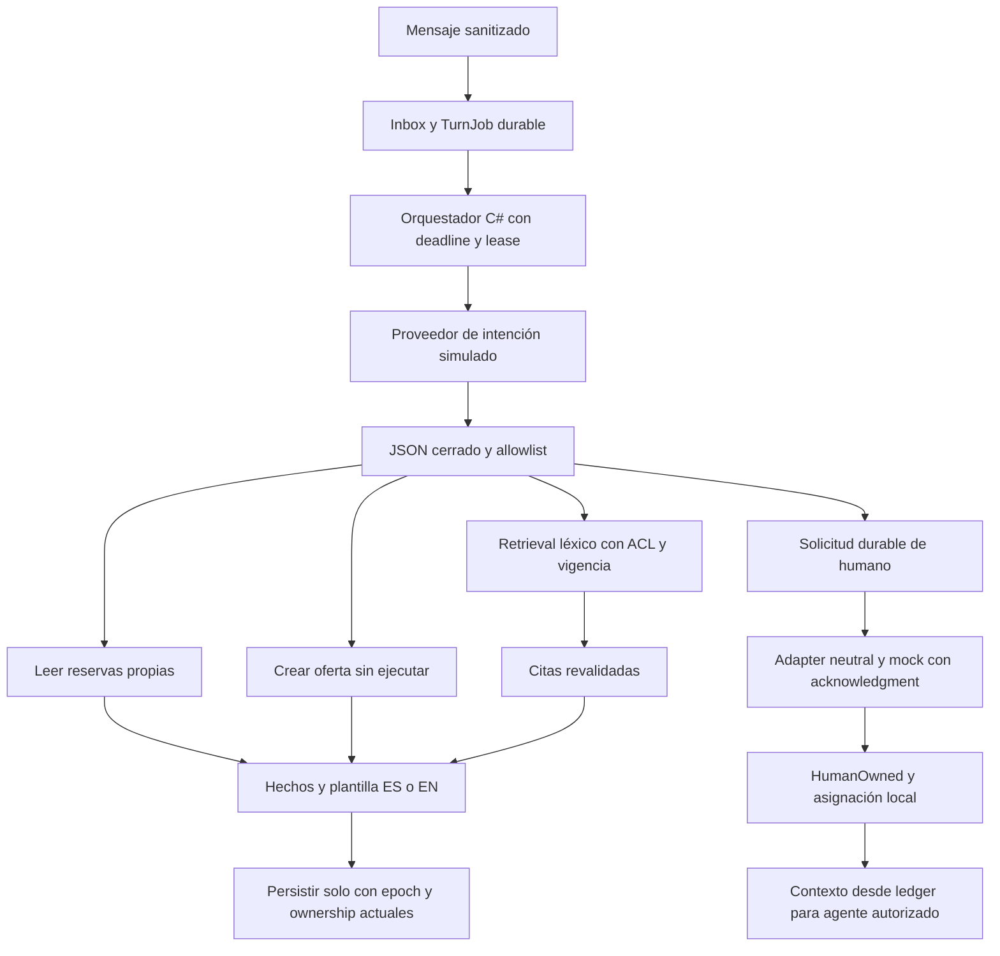

# Architecture Freeze v0.5 — Demo funcional con asistente simulado

Estado: **CLOSED antes de implementación**, 2026-10-01 UTC. [ADR-017](adr/017-reproducible-assistant-and-contact-center-mock.md) justifica los refinamientos locales; freeze v0.4 conserva las transacciones y sus invariantes.

## Definition of Ready y alcance

Activar respuesta ES/EN, FAQ con citas, consulta propia, preview solicitado por chat, aclaración, handoff mock y vista de agente asignado. Persistencia: TurnJob/result/control/handoff y corpus gobernado en Operational SQLite. API local nueva: GET conversation assistant, POST handoff con Origin/CSRF, GET citation por versión con contexto autorizado y GET agent conversations/context. Permisos provenientes de principal/assignment; ninguna identidad del chat. Respuesta de negocio viene de fuente/ledger. El texto «sí» solo recuerda el botón explícito.

Aceptación local: AC01–05/07/10/17–21/23/25–28/30 con proveedores y canal simulados; AC22 verifica métodos de gobierno con fixtures de roles; no afirma UI de autoría ni indexación Qdrant. Feedback persistido para revisión sin alterar conocimiento. B13 añade runner Python reproducible sobre casos C# exportados y manifest, no un benchmark de LLM ni el holdout empresarial de 200 casos.

Datos: KnowledgeVersion(document/version/language/section/content/tenant/ACL/status/validity/editor/reviewer/hash), TurnJob(turn/conversation/session/epoch/version/lease), TurnResult(turn/answerJSON), ConversationControl(ownership/requestId/requestEpoch/nextAttempt), Assignment y ledger ya existentes. No memoria de modelo como autoridad; no se retroprocesan Inbox históricos.

## Flujo y límites

El proveedor solo recibe texto sanitizado e idioma, sin sesiones, members, claves ni fuente HTTP. Recibe cero autoridad de mutación. La carga del corpus es data, nunca instrucción. FAQ no puede autorizar acciones. Gateway rechaza propuestas desconocidas/fuera de scope y usa fallback. Bot no genera nuevos resultados tras HumanOwned; operaciones Submitted/Unknown siguen reconciliando. Cancelación Pending aún no enviada se bloquea al pedir humano. Contexto señala incertidumbre y nunca interpreta «solicitado» como «cancelado» o «humano conectado».

## Pruebas y amenazas

Tests C# persistentes: propuesta desconocida/extra/member/URL, citas inexistentes/expiradas/privadas/revocadas, publicación por uploader prohibida, idioma, falta de evidencia, oferta no ejecutada por chat, budget/timeout, lease/replay, handoff failed/duplicado/viejo y silencio posterior, contexto asignado. Python exporta resultados de casos ES/EN del proveedor simulado con hash de corpus/dataset/versions y denominadores; no evalúa cloud. Browser verifica FAQ con cita, preview y cancelación ficticia, handoff y vista persistente. Observabilidad solo Activity/Meter y audit de IDs/códigos, sin hidden reasoning/PII.
