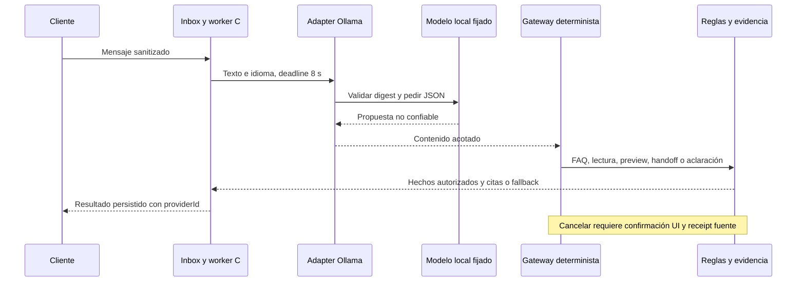

# Architecture Freeze v0.6 — Intenciones con IA real local

Estado: CLOSED para diseño, antes de implementación. Gate de activación separado; fecha 2026-10-01. [ADR-019](adr/019-local-live-intent-provider.md) Accepted. Mantener la presentación v0.5 y las bases existentes.

## Definition of Ready

Requisitos FR02/14, NFR06/11/15, AC01/25/26/32. Actores y permisos sin cambios. Puertos IIntentProvider/ProposalGateway existentes; única nueva dependencia es el proceso local Ollama instalado. Spike de compatibilidad: API tags/show verificados, modelo/digest/Q4_K_M y capacidades completion/tools/thinking disponibles; carga inicial real observada 32.11 s, fuera del deadline interactivo. Mock HTTP en pruebas reproduce el contrato y errores. Calidad/latencia del LLM se medirán antes de reclamar validación.

Contrato local refinado tras spike: POST fijo http://127.0.0.1:11434/api/generate, raw=true, stream=false, think=false, format JSON schema, temperature=0, num_ctx=2048, num_predict=128, num_gpu=0/num_thread=8, keep_alive=15m. Wrapper raw-chatml-empty-think-v1 fijo con cliente serializado/escapado JSON; no interpretar texto como roles. GET /api/tags previo valida tag/digest exactos. Payload no contiene member, tenant, roles, URLs, sesiones ni conversaciones. Cuerpo response acotado a 64 KiB, propuesta a 2048 caracteres. Se requiere done=true y done_reason=stop; rechazo de tool_calls, error o truncamiento. Solo se procesa response, sin exportar thinking. El language const proviene de la conversación, no del modelo. Spike raw/CPU respondió JSON válido en 2.938 s; Chat/GPU incompatible queda documentado en ADR-019, sin claim de calidad por un ejemplo.

La API devuelve provider/mode en un recurso público de configuración sin claves. UI muestra IA local real o simulador; respuestas viejas conservan providerId. Sin auth/mutations nuevas. Lanzador activa local-llm solo después de validar modelo y warmup; default conserva la selección local persistida. Un lanzador separado vuelve a simulated. No descarga ni reemplaza modelos. Proceso propio identificado para lifecycle; no detener Ollama ajeno ni cambiar variables permanentes del usuario.

## Flujo

## Aceptación y amenazas

- Digest distinto, modelo ausente, redirect, HTTP error, JSON inválido, respuesta incompleta/truncada, tool_calls, cuerpo excesivo y timeout se rechazan con código seguro; sin logs crudos.
- Tests del HTTP real del adaptador con handlers aislados, y safety de workflow/gateway/handoff existente. Payload/endpoint/digest/budget observables en fixture sin datos reales.
- Una ejecución C# con modelo real exporta los 40 casos públicos bilingües para Python. Reportar errores y N, tokens y latencias; cero benchmark simulado como real. No holdout empresarial de 200 ni calidad semántica general aprobada por este slice.
- Navegador: modo real visible, pregunta nueva con respuesta citada, sin repetir una cancelación ya demostrada. Rollback disponible; source y DB no se reinician.
- Prompt injection no se resuelve solo con instrucciones. Auth/ACL/CP-001/confirmación/epoch/source receipt siguen siendo las barreras.

Gate DONE local: integración real observada, tests relevantes PASS, evaluación honesta y guía actualizada. Gates externos SQL/Genesys/Qdrant/remote CI siguen abiertos; este slice no requiere credenciales cloud.
