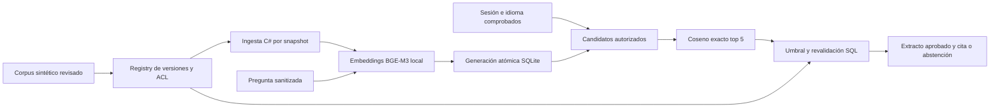
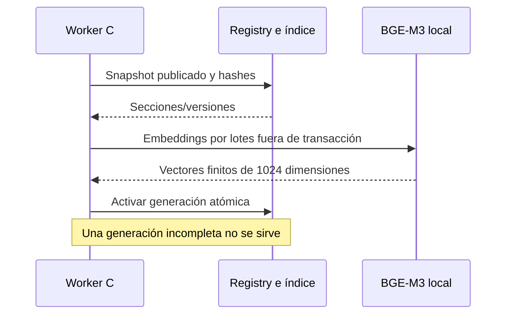

# Architecture Freeze v0.7 — Búsqueda y operación local

Estado: CLOSED para diseño antes de implementación. 2026-10-01. [ADR-020](adr/020-local-semantic-retrieval-and-operational-evidence.md) Accepted.

DoR: FR02/10–14/20/22, NFR06/10/11/18, AC01–03/21–26/30–32. Mantener identidad, estados y reglas de v0.6. Diseño aditivo: corpus 40 documentos lógicos traducidos, puerto de embeddings, índice SQLite, búsqueda del texto original, panel operativo restringido y backup/restore a ruta nueva. Sin nueva autorización de negocio ni write tool del modelo. Contratos y diagramas preceden el código; prueba real distinta de fixtures CI.

Aceptación local: dimensiones/digest/endpoint/deadline válidos, rechazar entradas/respuestas excesivas y errores; índice con generación atómica y reconstrucción después de reinicio; no filtrar información interna a cliente, sesión revocada, otro tenant ni agente sin asignación. Revocación/publicación/expiry/hash se revalidan después de ranking. Sin evidencia suficiente → abstención con oferta humana. Dataset 200 ejecutado con split público reproducible, métricas y fallos honestos. Panel muestra solo agregados y últimos eventos sanitizados; actor normal no puede leerlo. Backup consistente y restore aislado verificado. Mantener el historial del usuario.

Amenazas: vector/model poisoning, índice desactualizado, inferencia indisponible, consumo de CPU, fuga de documentos y telemetría. Barreras: pin, límites, hashes, ACL SQL antes/después, publicación por reviewer separado, etiquetas cerradas, panel RBAC, backup excluido del ZIP. Datos sintéticos únicamente.

Gates externos siguen abiertos: SQL/HTTPS de producto, Qdrant/ANN, Angular, Genesys tenant, CI remoto, retención/global logout y carga empresarial. No se atribuye certificación a esta entrega.
