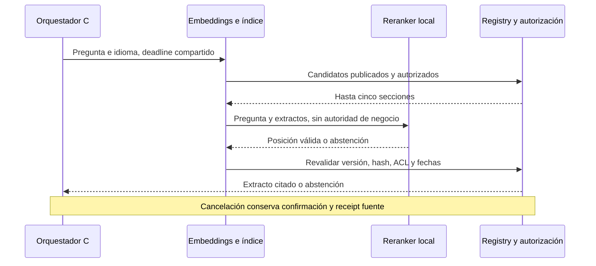

# Architecture Freeze v0.8 — Selección de fuente autorizada

Estado: CLOSED para diseño antes de implementación. 2026-10-01. [ADR-021](adr/021-bounded-evidence-selection.md) Accepted. Conserva los datos, permisos e invariantes v0.7.

DoR: defectos publicados con casos/reason codes; solo adaptar ranking de FAQ con un puerto `IKnowledgeReranker`. No introducir write tools ni generación factual. Reranker explícito en local-llm; fixture/topic del simulador permanece reproducible.

AC: choice fuera de rango, propiedades extra, endpoint/digest distinto, thinking/tool_calls, truncamiento y timeout no seleccionan evidencia. Entrada escapada JSON; extractos acotados. ACL antes de inferencia y después de elegir. Tiempo transcurrido cuenta para expiry; actor revocado durante inferencia rechazado. Invariantes y fixture tests PASS; regresión real se publica aunque falle. No declarar holdout nuevo ni cerrar gates empresariales por esta mejora.
