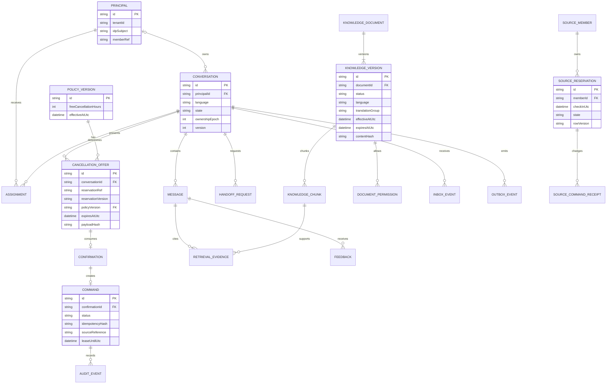

# Modelo conceptual de datos

**Entrega actual:** [demo local v0.6](../progress/demo-v0.6.md): SQLite, intención con IA real local o simulador explícito, contact center mock, evidence por temas, confirmación y recovery. Las secciones empresariales siguientes mantienen el objetivo y sus gates.

El ERD identifica entidades y relaciones; no es DDL ni un esquema físico definitivo. PK/FK son referencias conceptuales. La fase M1 decide tipos, índices y migrations manteniendo estas constraints.

## Autoridad y límites de almacenamiento

**Operational DB:** Principal/MemberRef, Conversation, Assignment, Message, CancellationOffer, Confirmation, Command, HandoffRequest, KnowledgeDocument/Version/Chunk, DocumentPermission, PolicyVersion, RetrievalEvidence, Feedback, InboxEvent, OutboxEvent, AuditEvent. TenantId obligatorio en claves/queries para el único tenant sintético; no se afirma aislamiento multi-tenant listo.

**Simulator DB externa:** SourceMember, SourceReservation y SourceCommandReceipt. No hay FK ni JOIN cruzado desde Operational DB; `reservationRef/memberRef/commandId` son referencias de integración. API/worker no obtienen grants fuente. Reserva y miembro pueden mostrarse en ERD por contexto, pero no son agregados propiedad del middleware.

**Qdrant:** proyección de chunkId/version/generation, vector y metadata indexada. Contenido Markdown/chunks autorizados proceden de SQL. Índice borrado/reconstruido no cambia reglas ni permisos. Embedding model, dimensión y chunkingVersion pertenecen a IndexGeneration.

## Constraints esenciales

- Conversation: versión monotónica y ownershipEpoch, language es/en, principal nullable para anónimo; vínculo con sesión opaca antes del login. Assignment con vigencia/tenant/agent; no acceso de rol sin asignación.
- Offer: principal/epoch/resource/version/policyHash/expiry inmutables, penaltyMinorUnits=0 en v0.1. Unique Confirmation.offerId; Command.confirmationId unique para decision confirm. Rechazo puede existir sin comando.
- Command: ID estable, payloadHash, estado, tiempos, lease, attempts, sourceReference y lastReasonCode. IdempotencyRecord unique por tenant+principal+route+key; no almacenar keys secretas en traces.
- Inbox: unique provider+integrationId+externalEventId y payloadHash; distinto hash del mismo evento se pone en cuarentena. Outbox unique eventId y referencia de command/handoff; attempts/lease/epoch controlan despacho.
- KnowledgeVersion: contenido inmutable después de review, idioma/translationGroup, reviewer diferente de editor, effectiveAt/expiry, ACL, contentHash y state. Una versión activa por documento+idioma. IndexGeneration staging no se publica parcialmente.
- Citation: RetrievalEvidence vincula responseMessage con chunkId/version/section y hash. La cita directa revalida permisos actuales; conservar versión no concede acceso indefinido.
- PolicyVersion: reglas estructuradas CP-001 v1. El mapeo con documentos explicativos es explícito y validado al publicar. Texto RAG no escribe configuración ejecutable.
- AuditEvent: actor opaco, aggregateRef, action/reason/result, timestamps, versiones y correlationId. Append-only para cuenta runtime; administración/borrado gobernados, sin promesa de almacenamiento WORM.

## Estados de conocimiento

Draft → PendingReview → ApprovedForIndexing → Published. Alternativas: Rejected, Revoked, Expired o Superseded. No buscar ApprovedForIndexing hasta que una generación esté completa y SQL marque Published. Vencimiento se evalúa también en query; el worker de limpieza puede retrasarse sin exponer datos.

## Reconciliación y consistencia

Offer/Confirmation/Command/Audit/Outbox se escriben en transacción local. SourceCommandReceipt vive en fuente, con commandId único. No hay atomicidad global entre las dos bases; la máquina Unknown y la query de receipt resuelven incertidumbre. Retención de audit no elimina tombstone de confirmación/comando necesario para impedir replay durante la vida de reserva.

<!-- ER diagram is embedded from canonical .mmd during packaging. -->

<!-- BEGIN GENERATED DIAGRAMS -->

## ERD — Modelo conceptual

## Esquema físico incremental B03/B04

El [DDL operacional v001](../../deploy/local/operational-v001.sql) implementa Principal, UserSession, Conversation, Assignment, Idempotency, Message, Inbox y Audit. No materializa todavía offers/commands/outbox/knowledge ni copia entidades fuente. MemberRef es binding servidor; no es una tabla maestra de miembros. [Evidencia del slice](../progress/b03-b04-ingress.md) separa constraints SQL reales de integración C# pendiente.
