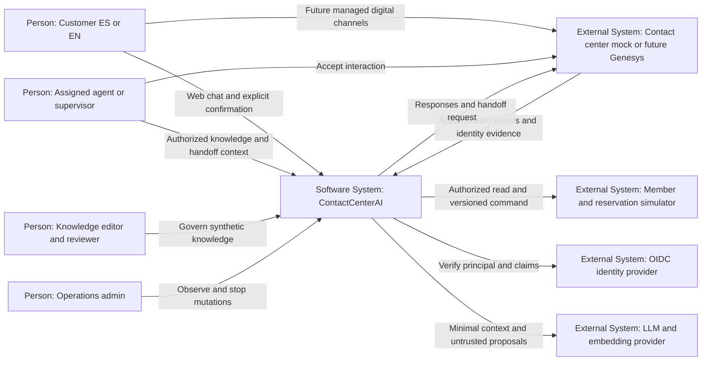
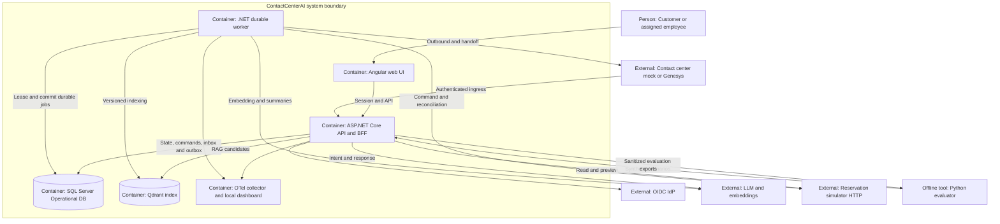
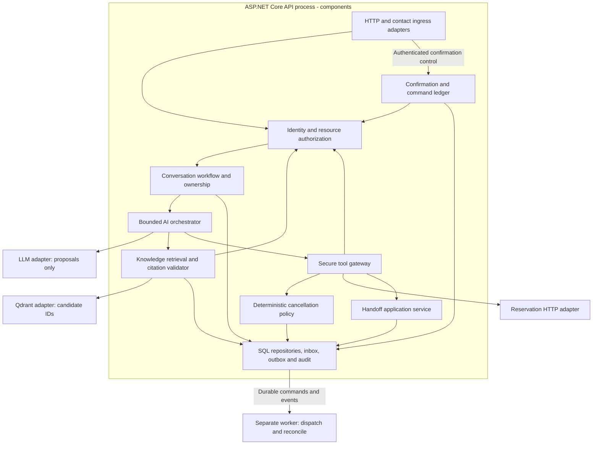
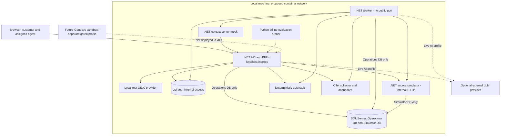

# Arquitectura, límites y C4

**Entrega actual:** [demo local v0.6](../progress/demo-v0.6.md): SQLite, intención con IA real local o simulador explícito, contact center mock, evidence por temas, confirmación y recovery. Las secciones empresariales siguientes mantienen el objetivo y sus gates.

## Estilo y unidad de despliegue

Se adopta un monolito modular ASP.NET Core .NET 10 para API/flujo conversacional y un worker .NET independiente para trabajo durable. Los módulos comparten Application/Domain por librerías; son componentes, no microservicios. Domain no depende de HTTP, SDK de Genesys, LLM ni EF Core. API y worker dependen de puertos de Application; Infrastructure implementa los adapters. La separación worker permite recuperar comandos sin mantener abierto un request.

Los diagramas C4 se expresan con `flowchart` Mermaid para portabilidad. Los niveles, fronteras y tipos están rotulados; no se usa la sintaxis C4 experimental. Deployment es una vista complementaria. Todo representa diseño propuesto, no infraestructura desplegada.

## Módulos y autoridad

| Módulo | Responsabilidad y autoridad |
|---|---|
| Identity / Access | Principal verificado, rol, recurso, asignación y ACL; deniega por defecto |
| Conversations | Mensajes sanitizados, estado, secuencia y ownership epoch; workflow determinista |
| AI Orchestration | Contexto mínimo, intent/proposals, límites y respuesta; sin autoridad transaccional |
| Knowledge | Registro de versiones/ACL, recuperación, citas, vigencia y feedback |
| Secure Tool Gateway | Allowlist, schema, permisos y validación; ejecuta puertos de lectura/preview |
| Reservation Policy | CP-001 v1, elegibilidad y oferta; reglas puras y testables |
| Command / Confirmation | Oferta consumible, idempotencia, ledger, leases y reconciliación |
| Handoff | Contexto, solicitud durable, epoch y transición a humano |
| Audit / Telemetry | Decisiones y resultados sanitizados; SQL audit durable, OTel técnico |

El sistema fuente de reservas es autoritativo sobre la transacción. El Policy Engine local puede anticipar elegibilidad, pero la fuente vuelve a validar; el preview no es commit. SQL operativo conserva lo que el middleware observó, sin afirmar que una fila local cambió la reserva externa.

## Puertos previstos

`ILanguageModel`, `IEmbeddingGenerator`, `IKnowledgeIndex`, `IReservationSystem`, `IContactCenterAdapter`, `IIdentityContext`, `IClock`, `IOperationalStore`, `IAuditWriter`. Son nombres de diseño, no interfaces implementadas. Contracts neutrales con DTOs de dominio, reason codes y CancellationToken técnico. Cancelar el token de transporte no implica revertir la transacción fuente.

Modelo/proveedor configura intent y respuesta. No se adopta framework agentic en v0.1: un workflow explícito es más fácil de auditar que un planner autónomo. Structured output estricto ayuda al formato y la validación local protege significado/permisos. Las capacidades del modelo exacto se verifican en spike, sin elegirlo por popularidad.

## Persistencia y concurrencia

SQL Server Operational DB: conversaciones, asignaciones, ofertas, confirmaciones, comandos, conocimiento Markdown/metadata, feedback, inbox/outbox y audit. Simulator DB separada: miembros/reservas sintéticos y command receipts. Mismo motor local puede alojar ambas, con identidades/grants separados; API solo habla con fuente vía HTTP, no hace JOIN ni update en su DB.

Qdrant mantiene vectores y referencias de chunks como proyección reconstruible. SQL guarda el corpus/version activa y permisos. No se autoriza con payload del índice únicamente. No Redis ni message broker: worker consulta inbox/outbox con leases y rowVersion en SQL. Escalar a broker solo cuando backlog/latencia/carga medida lo justifique.

Conversaciones procesan un turno activo por conversationId usando lease durable/version. Events externos se deduplican por provider+integration+eventId; recepción genera secuencia interna. Hora de evento no otorga precedencia sobre confirmación/handoff. Eventos de negocio comparan requestId y epoch. No se presume orden global de proveedores; si falta un prerrequisito el evento se retiene/rechaza con código en vez de aplicar una transición imposible.

## Ruta de mutación

La cancelación interna nace de una confirmación autenticada del control UI; no es una tool de escritura expuesta al modelo. SQL consume oferta e inserta intención antes del dispatch. Worker aplica kill switch, revalida recurso y llama fuente con commandId. Resultado incierto se reconcilia. Solo source Completed genera mensaje de éxito por plantilla. La IA puede reformular lectura/explicación, pero no cambiar estado/veredicto.

## Perfiles

- **Local deterministic:** IdP de pruebas, source/contact mocks, corpus sintético y LLM stub. Reproducible sin cuenta externa; no demuestra calidad de IA real.
- **Local live AI:** mismas fuentes mock, un proveedor/modelo y embeddings fijados, budget; mide calidad/costo del modelo sin datos reales.
- **Sandbox Genesys posterior:** adapter real y Architect configurados en tenant, sin reemplazar simulador de reservas inicialmente. Requiere gate de integración.
- **Producción:** diseño v0.1 no cubre HA, regulaciones, infraestructura corporativa ni políticas comerciales reales; requiere nuevo baseline.

## Dependencias y spikes previos a cada slice

| Dependencia | Selección / prueba de compatibilidad |
|---|---|
| .NET | .NET 10 LTS; ASP.NET Core y EF Core del mismo major; SDK/patch fijados en M1 |
| SQL Server | Imagen/edición local compatible y licencia revisada en M1; migrations separadas; no optimización vectorial en SQL |
| OIDC local | Discovery, issuer/audience, PKCE y claim mapping; no IdP escrito a mano |
| Qdrant | Imagen y cliente .NET fijados; prueba ACL filter, IDs/version y rebuild |
| AI provider | Schema support, tool responses, embeddings, retention y timeout; modelo por eval, no alias móvil |
| Genesys | Tenant/region/licencia, transporte, auth y handoff observables; mock por contrato neutral |
| Python / Angular | Versiones soportadas y locks al implementar evaluación/UI; no son dependencias del Domain |

El número de patch y imágenes se determina al ejecutar cada spike con fuentes actuales, no se congela a ciegas meses antes del código. Si falla una capacidad necesaria, se modifica ADR/baseline antes del slice afectado.

<!-- C4 diagrams are embedded from canonical .mmd files during packaging. -->

<!-- BEGIN GENERATED DIAGRAMS -->

## C4 L1 — Contexto

## C4 L2 — Contenedores

## C4 L3 — Componentes API

## Deployment — Perfil local

