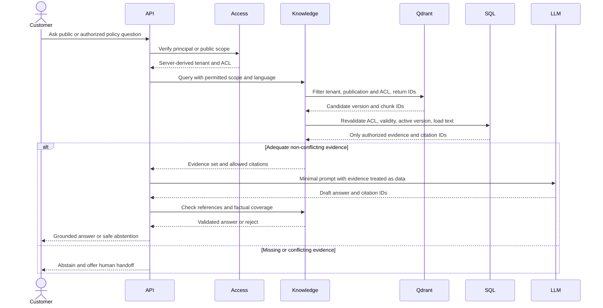
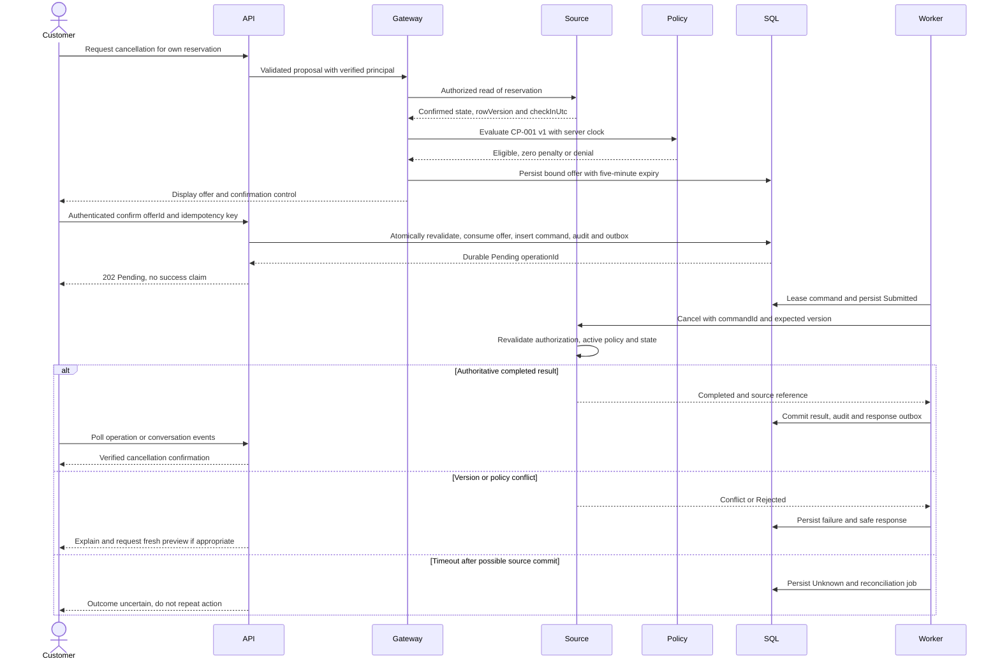
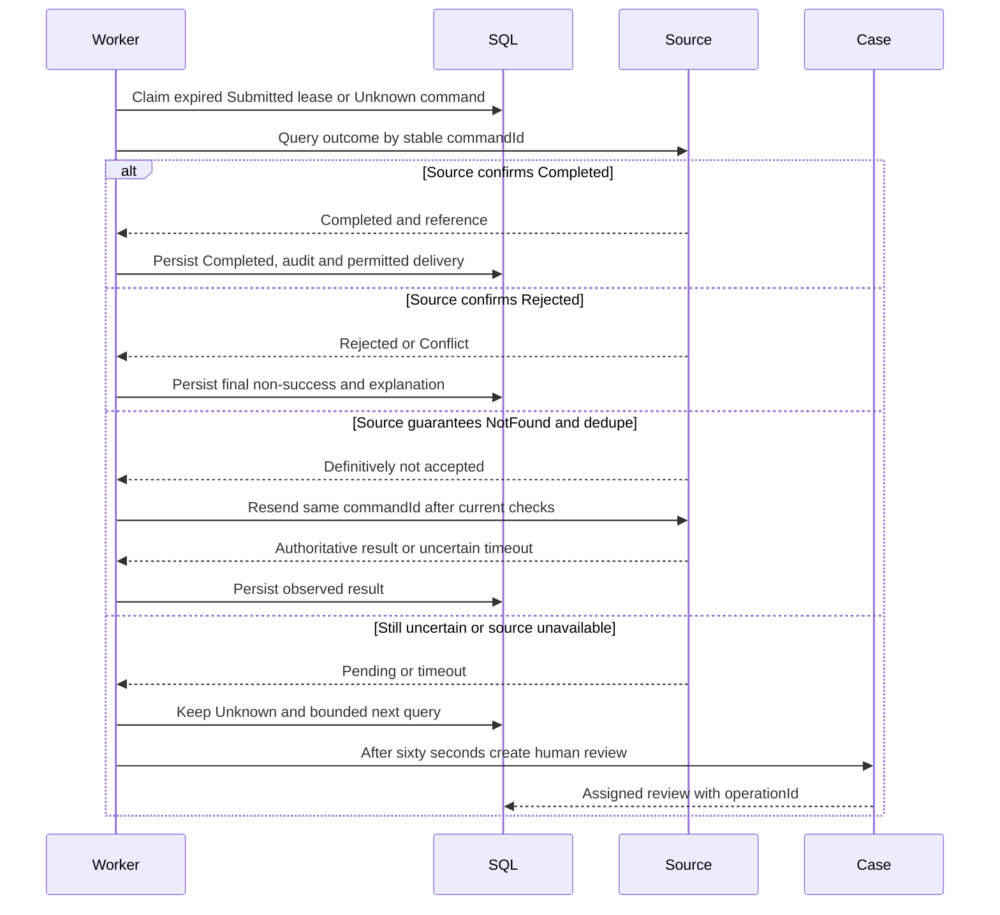
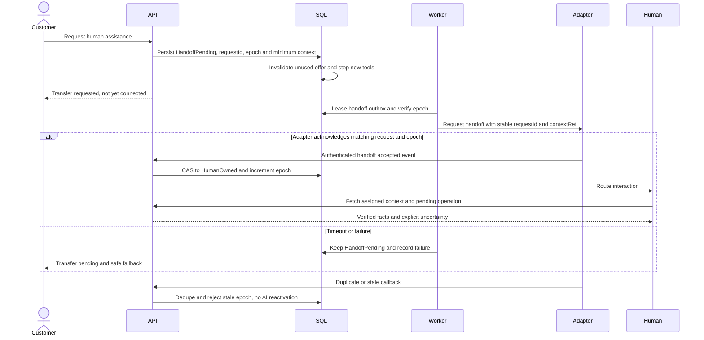
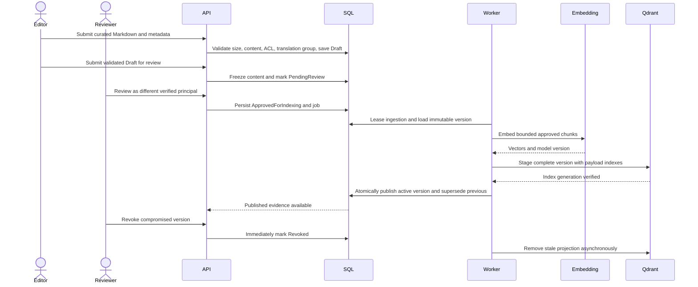
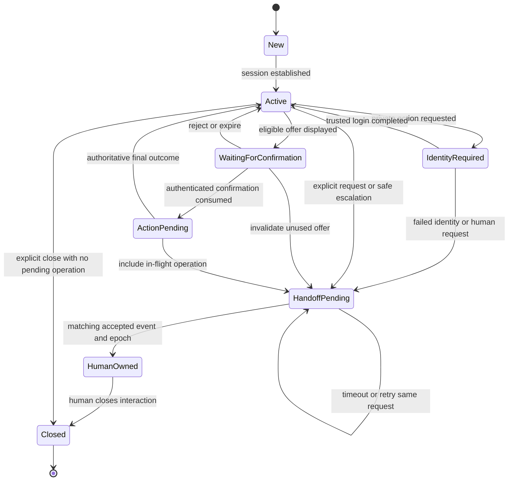
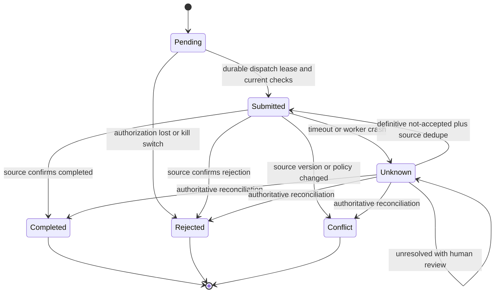

# Flujos, estados e invariantes

Estos diagramas definen transiciones y fronteras del MVP. No son llamadas a implementaciones existentes. RAG y tools producen evidencia/propuestas; solo el workflow servidor puede cambiar estado. Un turno tiene una propuesta activa; las tools son secuenciales.

## Invariantes

| ID | Invariante |
|---|---|
| INV01 | Identidad y permisos proceden del backend/IdP, nunca del LLM o texto de usuario. |
| INV02 | Cancelación requiere recurso autorizado, oferta vigente, confirmación propia consumida, estado/versión/política actuales y validación fuente. |
| INV03 | Solo resultado fuente Completed puede comunicar éxito. Submitted, Pending y Unknown nunca equivalen a cancelado. |
| INV04 | Un commandId no cambia payload ni representa dos efectos; una oferta se consume como máximo una vez. |
| INV05 | Documento/chunk no autorizado, revocado o vencido no entra al modelo ni se devuelve por cita. |
| INV06 | HumanOwned bloquea nuevos mensajes/tools de IA; callback viejo no cambia ownership. |
| INV07 | Ningún HTTP 202 reconoce evento/comando antes de persistencia SQL durable. |
| INV08 | Reglas, ACL y consecuencias se conservan al cambiar idioma/modelo/prompt. |

## Particularidades de transición

`ActionPending` es estado de conversación; Command tiene su propia máquina. Transferir o cerrar el navegador no borra ni revierte un comando Submitted. Unknown permanece hasta observación autoritativa o intervención humana documentada; abrir un caso humano no implica resolver la reserva.

HandoffPending permite solo mensajes deterministas de estado mientras se solicita la transferencia; la IA deja de proponer nuevas operaciones. Tras acknowledgment, cambia epoch y HumanOwned. Los outbox anteriores verifican epoch antes de emitir. No hay reactivación automática del bot en v0.1; retomar IA exige nueva conversación/control y un diseño posterior de reclaim.

Eventos de aceptación de handoff contienen requestId/epoch actuales; no se autentican por esos IDs únicamente. La máquina se aplica con compare-and-swap y event dedupe. Para canal de entrega sin dedupe verificable, el mock ensaya Unknown y recuperación; no se promete exactamente una vez.

La secuencia de cancelación muestra ruta feliz y dos fallos. Los checks locales antes de confirmar reducen conflictos, pero la última validación fuente sigue siendo obligatoria. El resumen y la respuesta final usan el ledger de hechos; no se deducen de conversación libre.

<!-- Workflow diagrams are embedded from canonical .mmd files during packaging. -->

<!-- BEGIN GENERATED DIAGRAMS -->

## Secuencia — RAG



## Secuencia — Cancelación



## Secuencia — Reconciliación



## Secuencia — Handoff



## Secuencia — Ingesta



## Estado — Conversación



## Estado — Comando



## Sesión y recepción B03/B04


```mermaid
sequenceDiagram
  actor Customer
  participant BFF
  participant IdP
  participant SQL
  Customer->>BFF: HTTPS GET CSRF bootstrap
  BFF-->>Customer: Antiforgery token and secure cookie
  Customer->>BFF: POST anonymous session with Origin and CSRF
  BFF->>SQL: Persist opaque guest session
  BFF-->>Customer: HttpOnly Secure session cookie
  Customer->>BFF: POST login with Origin and CSRF
  BFF->>IdP: Authorization Code and PKCE S256
  IdP-->>BFF: Validated callback with state and nonce
  BFF->>SQL: Bind trusted issuer and subject; rotate session; adopt owned guest conversations
  BFF-->>Customer: New cookie; no saved tokens
  Customer->>BFF: POST conversation with new CSRF and idempotency key
  BFF->>SQL: Revalidate active session and binding
  BFF->>SQL: SERIALIZABLE conversation plus idempotency plus audit
  SQL-->>BFF: Committed conversation ID
  BFF-->>Customer: 201 and version
  Customer->>BFF: POST message with If-Match and clientMessageId
  BFF->>SQL: Revalidate owner or active assignment; deduplicate
  BFF->>SQL: Commit sanitized message plus Pending inbox plus audit
  SQL-->>BFF: Committed receipt
  BFF-->>Customer: 202 Pending; no business success
```
