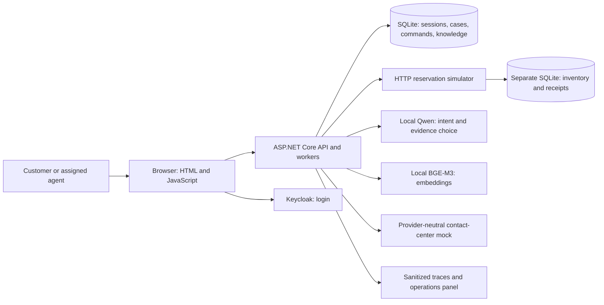
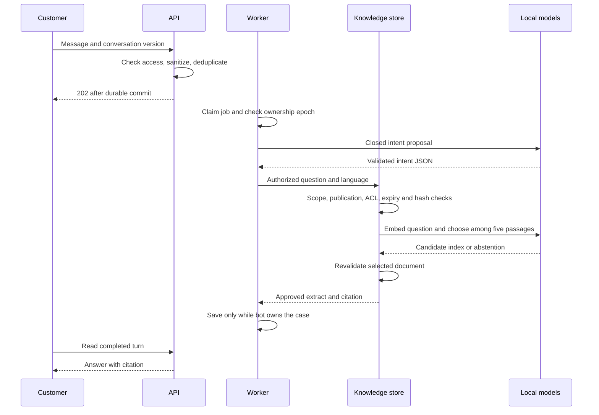
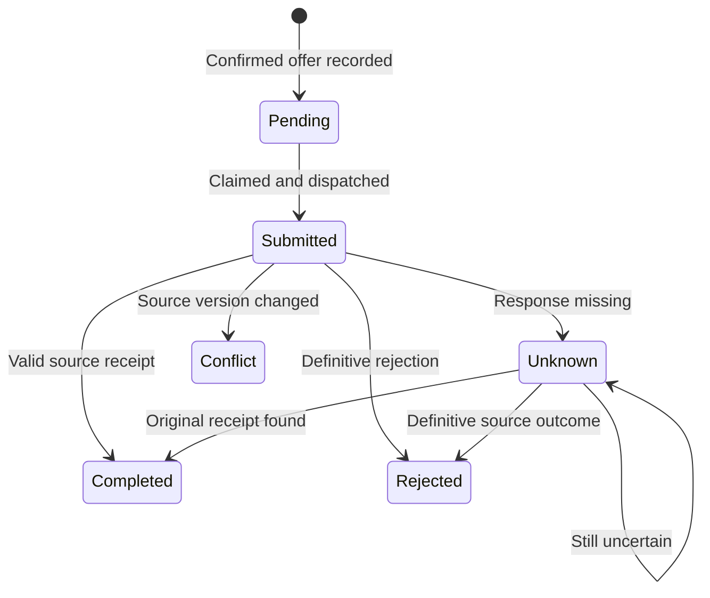

# How ContactCenterAI works

## Problem and scope

The fictional Caribbean Horizon property needs a bilingual assistant for policies and a small reservation workflow. A wrong answer is inconvenient; a cancellation performed for the wrong person or reported before it happened is more serious.

The model proposes bounded intents and selects evidence. C# owns identity, permissions, policies and state changes. The completed local scope includes FAQs, reservation reads, penalty-free cancellation under fictional CP-001, and simulated human transfer. Payments, refunds, voice, real inventory and a live contact-center tenant are outside that scope.

Acceptance rules: another customer cannot read your case; an agent needs an assignment; “yes” does not cancel; a stale offer is rejected; one business command has one source effect; a timeout cannot be reported as success.

## Pieces and responsibilities



`Domain` contains policy and resource rules. `Application` coordinates use cases through interfaces. `Infrastructure` implements storage, HTTP clients and local model providers. `Api` handles HTTP, login and composition; its workers consume durable jobs. `Simulator` represents the external reservation system. Provider-specific types stay outside the domain.

SQLite makes the portfolio easier to run; it does not prove the enterprise SQL Server repository end to end. The source has another database deliberately: the assistant's record of a requested action is not proof that the reservation changed.

## Login and permissions

The browser follows Keycloak's Authorization Code + PKCE flow. The server validates the response, then maps the trusted issuer and subject to a synthetic local principal. It creates an opaque, short-lived persistent session and does not place provider tokens in the cookie.

Each read or action checks session, tenant, role and ownership or active assignment. A role alone does not grant every case. A name or member number typed in chat never changes identity. The local presentation uses HTTP loopback; deployment needs HTTPS and stronger operational controls.

## Answering a question



RAG means finding relevant knowledge before answering. BGE-M3 creates 1,024-dimensional vectors. The demo uses exact cosine similarity over 80 published language variants. Qwen selects one of the top five candidates or abstains. The response is an approved extract with a versioned citation, rather than unrestricted factual prose.

Publication requires a reviewer different from the editor. Expired, revoked, superseded or unauthorized versions cannot be returned. The selected evidence is checked again before delivery. A bounded scope filter rejects known explicit requests outside the demo; it is not a universal prompt-injection detector.

## Cancelling a fictional reservation

```mermaid
sequenceDiagram
    participant C as Customer
    participant APP as C# workflow
    participant L as Durable ledger
    participant S as Reservation source
    C->>APP: Prepare cancellation of RES-001
    APP->>S: Read owned reservation and source version
    APP->>APP: CP-001: confirmed and at least 72 hours away
    APP-->>C: Five-minute offer; no cancellation yet
    C->>APP: Confirm with offer, version and idempotency key
    APP->>L: Consume offer, record command and audit atomically
    APP-->>C: 202 Pending
    APP->>S: Original command ID and expected source version
    S->>S: Validate, change reservation and save receipt atomically
    alt receipt arrives
        S-->>APP: Valid Completed receipt
        APP->>L: Mark Completed
        APP-->>C: Cancellation confirmed
    else response lost
        APP->>L: Mark Unknown
        APP->>S: Look up same command ID
        S-->>APP: Original result or unresolved
        APP->>L: Reconcile or request human review
    end
```

Idempotency prevents a retried command from applying its source effect twice. It does not mean every network request happens once. The source stores its result under an immutable command ID. A lease lets a worker resume durable work; fencing stops an old worker from saving over a new owner.



A kill switch blocks new writes while allowing receipt reads. An unresolved operation goes to human review; it is never turned into a new command just to show success.

## Human ownership and data

`HandoffPending` pauses the bot immediately. The mock's acknowledgment must match the request ID and ownership epoch before changing the case to `HumanOwned`. Old acknowledgments are ignored. Assigned agents can read their cases; unassigned agents cannot. This tests the boundary and race rules, not routing in a live Genesys tenant.

The operational database holds principals, sessions, conversations, sanitized messages, jobs, offers, commands, assignments and versioned knowledge. The source holds reservations and receipts. `MemberRef` comes from a trusted identity binding. See the detailed [data](../diagrams/data-model.mmd), [C4](../diagrams/c4-containers.mmd) and [conversation state](../diagrams/state-conversation.mmd) diagrams.

Browser, identity provider, model, reservation source and future messaging providers cross separate trust boundaries. Treat text, passages and model output as untrusted. Keep tokens, raw conversations, phone numbers and hidden reasoning out of telemetry.

## Decisions and tradeoffs

| Choice | Reason and limitation |
|---|---|
| Modular monolith | Easier debugging and local transactions; scale remains future work |
| Closed model proposals | Smaller attack surface; less conversational flexibility |
| Separate source | Makes authoritative confirmation testable; introduces network uncertainty |
| Exact vector search | Sufficient for this corpus; not a Qdrant scale benchmark |
| Local inference | No inference API bill; speed depends on the computer and pinned models |
| Fixtures plus real outputs | Reproducible safety and visible errors; independent review still needed |

[ADRs](../adr/README.md) record decisions before implementation. Each slice needs requirements, acceptance criteria, contracts, diagrams, threats and a closed local architecture freeze. A freeze authorizes that slice, not every enterprise feature.
