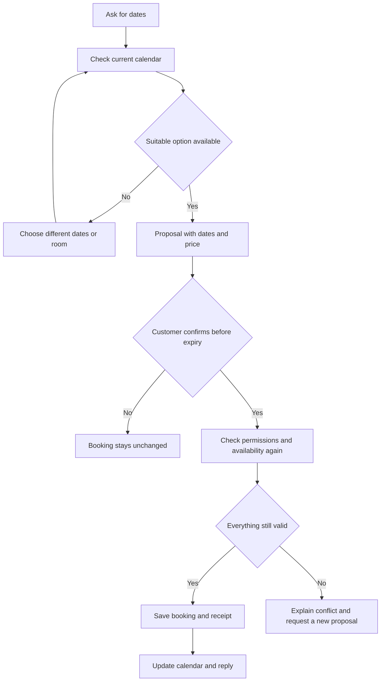

# ContactCenterAI in plain language

[Home](../../README.md) · [Español](../es/como-funciona.md) · [Try it](../resort-demo.en.md)

Imagine a small hotel answering WhatsApp questions. The customer wants to compare rooms, check prices and find available dates. This demo follows that journey with a fictional property.

## A booking from start to finish

1. The customer asks for dates. The demo checks current inventory.
2. They choose a Suite, complete dates and the number of guests.
3. The demo shows a proposal. Two nights at USD 280 cost 560 fictional USD.
4. The customer reviews and explicitly confirms that proposal within five minutes.
5. The system checks the room again and saves the stay. The website shows occupied nights.
6. A date change requires another proposal. An occupied destination leaves the old stay intact.
7. An eligible cancellation releases the nights and keeps the historical record.

## Why the account link matters

A phone number identifies a chat, but it does not prove which hotel account the person can use. The customer signs in to the local website with a fictional account. The website generates a code. They send it to WhatsApp and confirm the link back in the same browser session.

The code lasts five minutes. The link ends on logout or session expiry, after at most fifteen minutes. The bot never asks for a password in WhatsApp. “My bookings” returns stays belonging to that verified account.

## Where answers come from

| Question | Source |
|---|---|
| What a room includes | Catalog with amenities and capacity |
| How much it costs | Stored fictional rates |
| Which dates are available | Inventory updated by bookings and cancellations |
| Which bookings are mine | Records filtered by the verified account |
| What the policy says | Approved English and Spanish knowledge |

The calendar acts like an occupancy ledger. Each room can have only one allocation per night. If two customers confirm the last available room simultaneously, only one can occupy it.

## What AI means here

The current resort recognizes a bounded set of phrases and commands through deterministic rules. `/en` and `/es` select the language. Incomplete dates require clarification.

A separate local profile uses Qwen and document retrieval with BGE-M3. That retrieval is called RAG: it finds relevant passages in approved documents and includes a reference with the answer. Its evidence stays separate. A model can propose an intent, while the server checks identity, price and permissions before acting.

## If the connection drops

A completed booking stays saved even if its message fails to arrive. The system keeps a receipt and recovers using the same operation identifier. Repeating a confirmation does not create another booking. If a response is uncertain, check “My bookings” before requesting another operation.

## What has been demonstrated

The real WhatsApp test walkthrough completed booking, date change and cancellation, matching the website inventory. Hotel and money are fictional. Telegram has no live bot configured. Human transfer and Genesys remain simulated. Receiving messages requires the PC, local services and tunnel to keep running. [Evidence and limits](../progress/resort-v0.12.md).

For technical detail: [architecture and rules](../resort-booking-v0.12.en.md), [executable contract](../contracts/resort-v0.12.md) and [original AI profile](engineering-guide.md).
