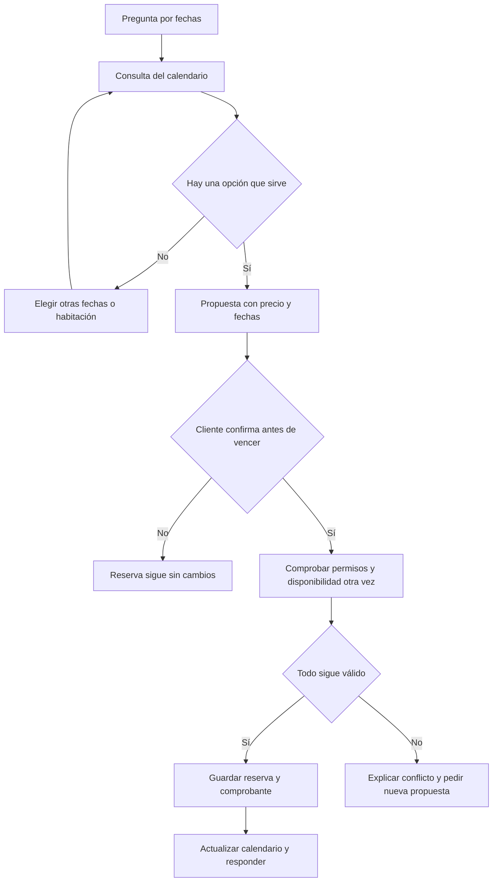

# ContactCenterAI, explicado sin tecnicismos

[Portada](../../README.es.md) · [English](../en/how-it-works.md) · [Probarlo](../resort-demo.es.md)

Imagina un hotel pequeño que recibe preguntas por WhatsApp. El cliente quiere comparar habitaciones, consultar precios y encontrar fechas libres. Esta demo reproduce ese recorrido con un hotel inventado.

## Una reserva de principio a fin

1. El cliente pregunta por fechas. La demo consulta el calendario actual.
2. Elige una Suite y escribe fechas completas y cantidad de huéspedes.
3. Recibe una propuesta. Dos noches a 280 USD cuestan 560 USD ficticios.
4. Revisa y confirma esa propuesta concreta antes de cinco minutos.
5. El sistema comprueba la habitación otra vez y guarda la estadía. La página muestra esas noches ocupadas.
6. Un cambio requiere otra propuesta. Si el destino está ocupado, conserva la reserva anterior.
7. Una cancelación dentro del plazo libera las noches y conserva el historial.

## Por qué hay que vincular la cuenta

El teléfono identifica un chat, pero no prueba qué cuenta del hotel puede usar. El cliente entra en la página con una cuenta ficticia. La página genera un código, el cliente lo envía al chat y confirma el vínculo de vuelta en la misma página.

El código dura cinco minutos. El vínculo termina al salir o vencer la sesión, que dura quince minutos. El bot nunca pide la contraseña por WhatsApp. Así, «Mis reservas» devuelve solo las estadías de esa cuenta.

## De dónde salen las respuestas

| Pregunta | Fuente |
|---|---|
| Qué incluye una habitación | Catálogo de amenidades y capacidad |
| Cuánto cuesta | Tarifas ficticias guardadas |
| Qué días están libres | Calendario actualizado al reservar o cancelar |
| Cuáles son mis reservas | Registros filtrados por la cuenta verificada |
| Cuál es la política | Textos aprobados en español e inglés |

El calendario funciona como un libro de ocupación: una habitación puede tener una sola asignación por noche. Si llegan dos confirmaciones al mismo tiempo, solo una puede ocupar la última habitación.

## Qué significa IA aquí

El resort actual reconoce un conjunto acotado de frases y comandos mediante reglas deterministas. `/en` y `/es` cambian el idioma. Fechas incompletas requieren aclaración.

Otro perfil local usa Qwen y búsqueda de documentos con BGE-M3. Esa búsqueda se llama RAG: encuentra pasajes de documentos aprobados y acompaña la respuesta con una referencia. Conservamos sus resultados por separado. Un modelo puede proponer una intención, mientras el servidor comprueba identidad, precio y permisos antes de ejecutar.

## Si se corta la conexión

Una reserva completada sigue guardada aunque falle la entrega del mensaje. El sistema conserva un comprobante y recupera la operación con el mismo identificador. Repetir la confirmación no crea otra reserva. Ante una respuesta incierta, consulta «Mis reservas» antes de pedir otra operación.

## Qué está comprobado

El recorrido de crear, cambiar y cancelar pasó por WhatsApp real de prueba, con cambios coincidentes en la página. Hotel y dinero son ficticios. Telegram aún no tiene bot real, y la cola humana y Genesys siguen simulados. Para recibir mensajes deben seguir activos la PC, sus servicios y el túnel. [Evidencia y límites](../progress/resort-v0.12.md).

Para los detalles técnicos: [arquitectura y reglas](../resort-booking-v0.12.es.md), [contrato ejecutable](../contracts/resort-v0.12.md) y [perfil original de IA](guia-ingenieria.md).
