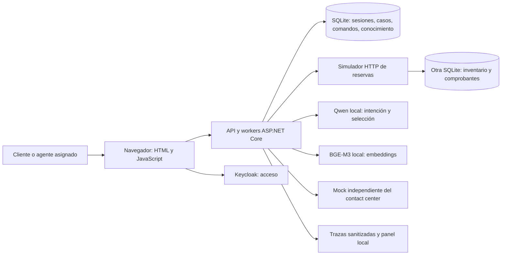
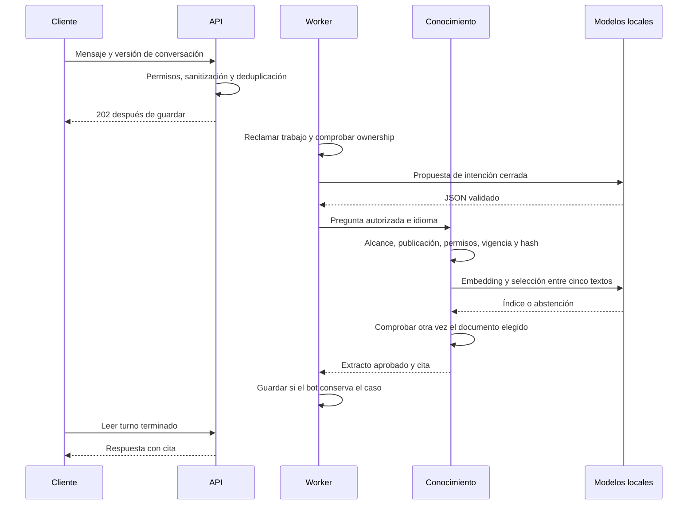
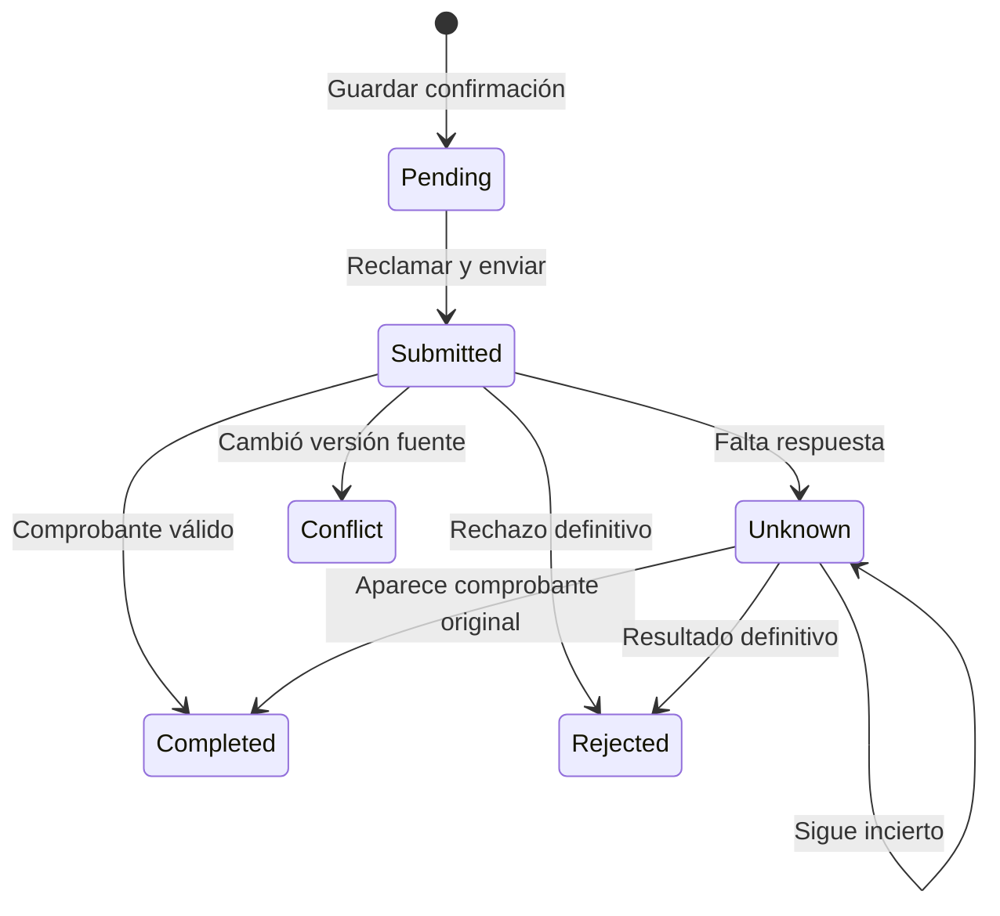

# Cómo funciona ContactCenterAI

## Problema y alcance

La propiedad ficticia Caribbean Horizon necesita un asistente bilingüe para sus políticas y un flujo pequeño de reservas. Una respuesta equivocada molesta; cancelar para otra persona o anunciarlo sin comprobar la fuente es un fallo más serio.

El modelo propone intenciones y selecciona evidencia dentro de límites. C# controla identidad, permisos, políticas y estados. La demo terminada incluye preguntas frecuentes, lectura de reservas, cancelación sin penalidad bajo CP-001 ficticia y transferencia humana simulada. Pagos, reembolsos, voz, inventario real y un tenant de contact center están fuera de ese alcance.

Criterios principales: otro cliente no puede leer tu caso; un agente necesita asignación; «sí» no cancela; una propuesta vencida se rechaza; un comando produce un efecto fuente; un timeout nunca se anuncia como éxito.

## Piezas y responsabilidades



`Domain` contiene políticas y reglas de acceso. `Application` coordina casos de uso mediante interfaces. `Infrastructure` implementa almacenamiento, HTTP y modelos locales. `Api` recibe peticiones, gestiona el login y conecta las piezas; sus workers consumen trabajos persistentes. `Simulator` representa al sistema externo de reservas. Los tipos de un proveedor no entran al dominio.

SQLite facilita ejecutar el portafolio; no demuestra todavía el repositorio empresarial completo de SQL Server. La fuente tiene otra base a propósito: registrar una solicitud no prueba que la reserva cambió.

## Login y permisos

El navegador sigue Authorization Code + PKCE de Keycloak. El servidor valida la respuesta y vincula issuer y subject confiables con una identidad ficticia local. Crea una sesión opaca, persistente y corta; no pone tokens del proveedor en la cookie.

Cada lectura o acción comprueba sesión, tenant, rol y propiedad o asignación activa. Tener un rol no abre todos los casos. Un nombre o número de miembro escrito en el chat nunca cambia la identidad. La presentación usa HTTP en loopback; desplegar exige HTTPS y controles operativos adicionales.

## Responder una pregunta



RAG significa buscar conocimiento relevante antes de responder. BGE-M3 genera vectores de 1,024 dimensiones. La demo compara por coseno exacto 80 variantes publicadas. Qwen selecciona uno de los cinco candidatos o se abstiene. Se entrega un extracto aprobado con cita versionada, en lugar de una respuesta factual libre.

Publicar exige un revisor distinto del editor. Una versión vencida, revocada, reemplazada o sin permisos no puede devolverse. La evidencia se vuelve a comprobar antes de entregarla. Un filtro acotado rechaza ciertas solicitudes explícitas fuera de alcance; no es un detector universal de prompt injection.

## Cancelar una reserva ficticia

```mermaid
sequenceDiagram
    participant C as Cliente
    participant APP as Flujo C#
    participant L as Registro persistente
    participant S as Fuente de reservas
    C->>APP: Preparar cancelación de RES-001
    APP->>S: Leer reserva propia y versión
    APP->>APP: CP-001: confirmada y faltan al menos 72 horas
    APP-->>C: Propuesta de cinco minutos; aún no cancela
    C->>APP: Confirmar con propuesta, versión y clave idempotente
    APP->>L: Consumir propuesta, guardar comando y auditoría juntos
    APP-->>C: 202 Pendiente
    APP->>S: ID original y versión fuente esperada
    S->>S: Validar, cambiar reserva y guardar comprobante juntos
    alt llega comprobante
        S-->>APP: Completed válido
        APP->>L: Marcar Completed
        APP-->>C: Cancelación confirmada
    else se pierde respuesta
        APP->>L: Marcar Unknown
        APP->>S: Buscar el mismo ID
        S-->>APP: Resultado original o incertidumbre
        APP->>L: Reconciliar o pedir revisión humana
    end
```

Idempotencia evita que reintentar un comando aplique dos veces su efecto. No significa que cada petición de red ocurra una sola vez. La fuente guarda el resultado bajo un ID que no cambia. El lease presta un trabajo temporalmente a un worker; el fencing impide que un worker viejo sobrescriba al dueño nuevo.



El kill switch bloquea escrituras nuevas y permite consultar comprobantes. Una operación incierta pasa a revisión humana; no se crea otro comando solo para mostrar éxito.

## Atención humana y datos

`HandoffPending` pausa el bot inmediatamente. La aceptación del mock debe coincidir con ID y época de ownership antes de pasar a `HumanOwned`. Una aceptación vieja se ignora. El agente asignado puede abrir su contexto; otro agente no. Esto prueba interfaz y concurrencia, no routing en un tenant real de Genesys.

La base operacional guarda identidades, sesiones, conversaciones, mensajes sanitizados, trabajos, propuestas, comandos, asignaciones y conocimiento versionado. La fuente guarda reservas y comprobantes. `MemberRef` procede de una vinculación confiable. Ver diagramas de [datos](../diagrams/data-model.mmd), [C4](../diagrams/c4-containers.mmd) y [estado de conversación](../diagrams/state-conversation.mmd).

Navegador, proveedor de identidad, modelo, fuente y canales nuevos cruzan fronteras de confianza distintas. Texto, documentos y salida del modelo son entradas no confiables. Tokens, conversaciones crudas, teléfonos y razonamiento oculto no deben aparecer en telemetría.

## Decisiones y compromisos

| Decisión | Motivo y límite |
|---|---|
| Monolito modular | Facilita depuración y transacciones locales; escala pendiente |
| Propuestas cerradas | Menor superficie de ataque; menos flexibilidad conversacional |
| Fuente separada | Permite comprobar autoridad; introduce incertidumbre de red |
| Búsqueda exacta | Basta para el corpus; no demuestra Qdrant a escala |
| Inferencia local | Sin factura de API; depende del equipo y modelos fijados |
| Fixtures y respuestas reales | Seguridad reproducible y errores visibles; falta revisión independiente |

Los [ADRs](../adr/README.md) registran decisiones antes del código. Cada slice necesita requisitos, criterios, contratos, diagramas, amenazas y freeze local cerrado. Ese cierre autoriza el slice definido; no cierra todos los pendientes empresariales.
