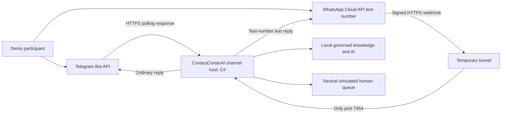
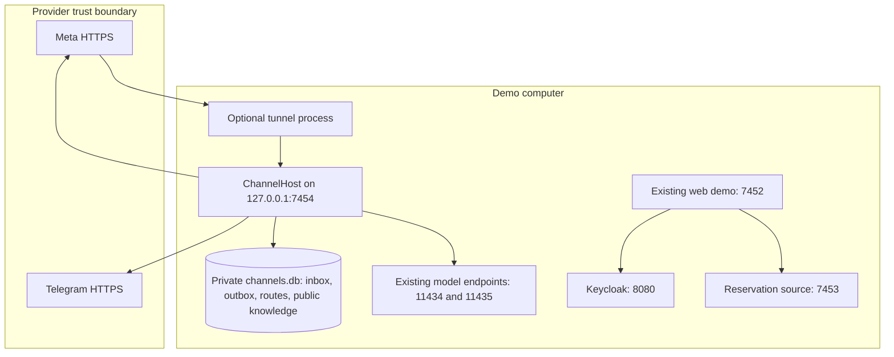
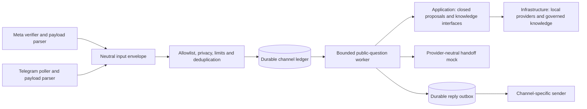
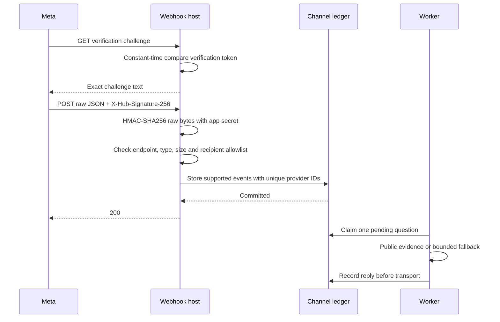
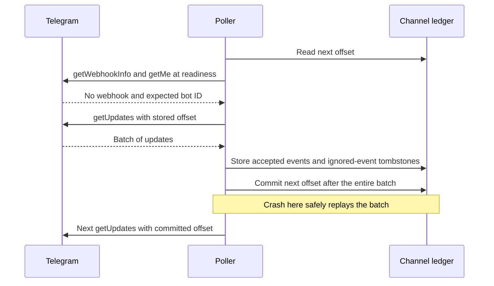
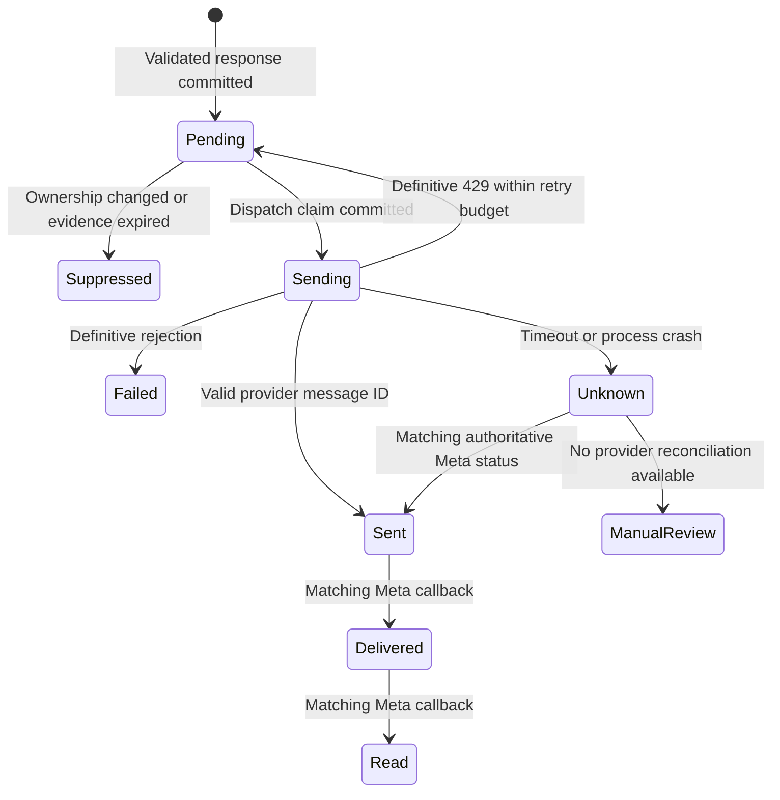
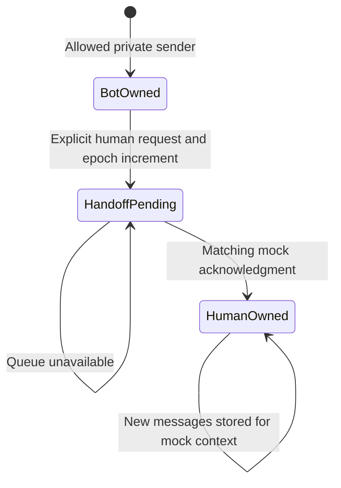
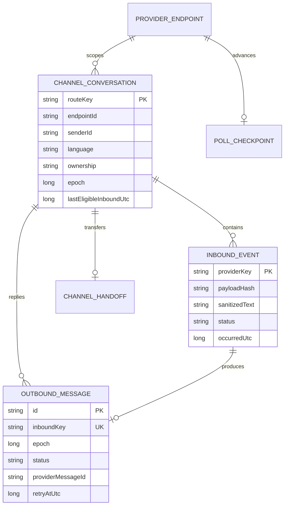

# WhatsApp and Telegram integration — architecture v0.11

[Español](channels.es.md) · [Freeze](../architecture-freeze-v0.11-channels.md) · [Contract](../contracts/channels-v0.11.schema.json) · [ADR-024](../adr/024-demo-messaging-channels.md)

Date: 2026-10-01. This is the design baseline for a new channel slice. The existing web demo stays v0.10. Live channel status belongs in a separate delivery report; this document alone is not evidence of a working Meta or Telegram account.

## 1. What we are adding

Two text channels share the same C# rules and local knowledge providers. Telegram uses the official Bot API with long polling. WhatsApp uses the official Cloud API **test number**, a small webhook host, and a temporary HTTPS tunnel. The first slice answers public questions in ES/EN, explains unsupported requests, and records a request for a **simulated** human queue. `/start`, `/es`, `/en` and `/human` are explicit controls. Media, groups, broadcast campaigns, paid templates and reservation writes are excluded.

The web demo's login and reservation workflow remain available. Messaging member access is a later slice: a provider sender identifier does not prove the sender owns a member account. A future account-link flow must prove control of both the channel and a real OIDC session before it can use reservations.

## 2. Cost and dependencies

| Piece | Demo choice | Condition |
|---|---|---|
| Inference and embeddings | Existing pinned local Qwen / BGE-M3 | Existing hardware; no cloud fallback or auto-download |
| Telegram | Private bot chats, `getUpdates` and ordinary `sendMessage` | Bot token, recipient allowlist; `allow_paid_broadcast=false` |
| WhatsApp | Meta test number and allowlisted test recipients | Test resources confirmed in the owner's dashboard; provider credentials required |
| Public HTTPS | Optional Cloudflare Quick Tunnel to port 7454 only | Temporary hostname, no SLA; update Meta callback when it changes |
| Storage | Separate local channel SQLite file | No new paid hosting and no changes to old databases |
| Contact center | Existing neutral boundary / local mock | No paid or live Genesys connection |

The target is **no additional service fees in the configured demo**. This is not a promise that a production WhatsApp number is free. No templates, campaigns, paid broadcast, voice or hosted inference are enabled. A missing token or cost setup keeps the relevant channel disabled. No unofficial WhatsApp Web automation or BSP subscription is introduced.

Primary sources, checked 2026-10-01: [Meta developer hub](https://whatsappbusiness.com/developers/developer-hub/), [Meta webhook verification](https://whatsapp.github.io/WhatsApp-Nodejs-SDK/api-reference/webhooks/start/), [Meta payload reference](https://www.postman.com/meta/whatsapp-business-platform/folder/tduohwq/webhook-payload-reference), [Telegram Bot API](https://core.telegram.org/bots/api), [Telegram FAQ](https://core.telegram.org/bots/faq), [Quick Tunnels](https://developers.cloudflare.com/tunnel/get-started/quick-tunnels/), [Ollama local-only mode](https://docs.ollama.com/faq). Provider terms can change; test-account setup is a live gate.

## 3. C4 context and deployment

The tunnel terminates public TLS and forwards only to the dedicated channel host. It does **not** expose the web demo, cookies, login callbacks, Keycloak, model endpoints or databases. The host publishes only Meta verification/webhook routes and a content-free liveness response; operator tools are local CLI operations. Bind on loopback even when the tunnel is active. Disable arbitrary URL configuration and redirect following in provider HTTP clients.

## 4. Components and dependency direction

New host/adapter code depends on Application and Infrastructure; Domain and Application do not import provider DTOs. A neutral envelope carries `channel`, `endpointId`, `eventId`, `senderId`, `receivedAtUtc`, `occurredAtUtc` and `text`. These are routing metadata, never `MemberRef`, principal, role or tenant authority. The configured endpoint fixes the tenant. One active worker per local ledger is the initial deployment assumption; enforce it with an exclusive process lock rather than claim untested multi-instance behavior.

Public questions use a persisted guest context with no roles and no member binding. That context permits **Public** knowledge only. If an intent proposes reservation access or cancellation, the worker returns `VERIFIED_MEMBER_REQUIRED` without contacting the reservation source. A separate channel ledger keeps per-sender language and human ownership. Knowledge is seeded from the same approved synthetic corpus in the new channel store; this does not silently publish new content into the existing web store.

## 5. Functional requirements and acceptance

| ID | Requirement | Acceptance case |
|---|---|---|
| CH-F01 | Private text messages normalize to a neutral envelope | Same pool question in each provider fixture reaches the public handler |
| CH-F02 | Authenticate and scope Meta input | Missing/bad raw-body HMAC: 401; wrong configured phone-number ID cannot create a job |
| CH-F03 | Poll Telegram with durable offsets | Persist the batch before requesting a higher offset; crash replay creates no duplicate job |
| CH-F04 | Scope recipients and input size | Groups, unknown recipients, media and text over 2,000 Unicode scalars do not invoke AI |
| CH-F05 | Support explicit ES/EN and privacy rules | `/en` persists language; labeled secrets/email/phone sanitized; payment data rejected |
| CH-F06 | Preserve knowledge authority | Guest cannot read Agent-classified passages; revoked evidence is not delivered |
| CH-F07 | Deny private business actions | A phone/Telegram ID or typed member number never triggers a reservation read/write |
| CH-F08 | Pause for human request | `/human` changes ownership epoch before further processing; queued bot replies become obsolete |
| CH-F09 | Preserve transport uncertainty | Timeout after sending becomes Unknown; no blind automatic resend of an uncertain reply |
| CH-F10 | Enforce demo cost mode | No template endpoints, campaigns, cloud inference or paid broadcast; missing configuration fails closed |

## 6. Non-functional requirements

- **CH-N01:** Meta body maximum 256 KiB, JSON depth 32, maximum 100 events per request; inbound rate limit 60 requests/minute per host plus durable daily caps of 100 accepted messages per recipient and 1,000 total. Allowlist before AI. Rate-limit excess is 429 and never bypasses deduplication.
- **CH-N02:** Meta replies with 200 only after every supported event is durably stored or deliberately ignored; malformed authenticated JSON is 400; unavailable storage is 503. Target local commit <1 second, to be measured. Do not wait for inference in the webhook.
- **CH-N03:** Shared eight-second question deadline; lease/recovery controls do not add unbounded model retries. One local inference job at a time. Overload stays pending or expires to a clear fallback.
- **CH-N04:** Telegram: one poller, positive 25-second long polling, 100 updates/batch, explicit allowed update types; no webhook concurrently. One outbound message/second globally is a conservative demo ceiling. Respect provider `retry_after` only for definitive 429 responses, at most three sends.
- **CH-N05:** Outbound plain text <=3,500 Unicode scalars, no automatic splitting or markup execution. Cite document ID/version/section/title in text; never send a loopback link that a phone cannot open.
- **CH-N06:** No access tokens, bot-token URLs, raw request bodies, sender IDs or message contents in logs/traces. Store only necessary routing metadata and sanitized text in ignored local storage. Tokens are process configuration; host exceptions return stable codes. Redirects disabled.
- **CH-N07:** Messages and routes are demo-only local data. Seven-day cleanup target, tombstone deduplication 30 days and no production compliance claim; verify cleanup before live release. Channel files require OS access restrictions. Filesystem encryption/backup policy is a production gate, not assumed from SQLite.
- **CH-N08:** Existing databases, source keys, identity accounts, model pins and v0.10 inference reports remain unchanged. New channel behavior has isolated tests and separate evidence.

## 7. Provider flows

The GET verification token validates subscription setup; it does not authenticate POST bodies. Meta signatures authenticate provider delivery, not the user's membership. Duplicate IDs with different normalized payload hashes are quarantined as `EVENT_CONFLICT`, never overwritten. Batches may be replayed after a partial failure; uniqueness handles this. Status callbacks do not create questions, and stale callbacks cannot downgrade Delivered/Read to Sent.

Never use `drop_pending_updates` automatically. If Telegram reports a configured webhook, stop with `TELEGRAM_WEBHOOK_CONFLICT`; the owner decides whether to remove it. Use a numeric configured bot ID as namespace, not the secret token. Store Telegram IDs as 64-bit values or decimal strings, not floating point. Private chat ID must match sender ID and configured allowlist. Edited posts and callback buttons are outside v0.11.

## 8. Outbound state and uncertainty

A durable outbox prevents losing a prepared reply. Neither adapter assumes provider-supported outbound idempotency. Sending is committed before the HTTP call; a crash or ambiguous response becomes Unknown and is not automatically resent. Telegram supplies no general receipt query by local outbox ID, so some uncertainty requires an operator. This trades a potentially missing reply for avoiding duplicate visible messages. Source-command idempotency in the web workflow remains a separate stronger guarantee.

Meta free-form replies require an eligible customer-service window. Use authenticated message timestamp, reject future clock skew >5 minutes and stop replies after 24 hours from the latest eligible inbound message; do not create a template fallback. Receiving another unrelated sender's message does not refresh that window. Recheck ownership, evidence and window immediately before dispatch. A send already in flight cannot be recalled; report this race honestly rather than promise no reply after handoff under every timing.

## 9. Human state and conceptual data

No user text or `/start` silently takes a case back from a human. Reset/reassignment is a later authenticated operator action, not an LLM tool. The new slice demonstrates a queue record and pause, not a working human service on WhatsApp/Telegram.

Unique inbox key: `(channel, endpointId, eventId)`. Telegram uses update ID; Meta uses message ID. Unique route: `(channel, endpointId, senderId)`, so the same numeric ID cannot cross providers or bots. Route metadata is private data even when it is not a password. Outbox rows retain citation references for revalidation. Poll checkpoint advances only after persistent acceptance/rejection of the batch. Handoff records contain immutable request ID and epoch.

## 10. Threat model and verification

| Threat | Control / acceptance oracle |
|---|---|
| Forged webhook or challenge used as POST auth | Raw-byte HMAC, constant-time compare, separate secrets; changed byte fails |
| Wrong bot/phone ID, group sender or forged identity | Fixed endpoint, private allowlist and roles=None; source fake records zero calls |
| Replays, reordered callbacks and worker crash | Durable unique keys, conflict hash, monotonic receipt states, crash replay tests |
| Prompt injection or malicious retrieved passage | Closed proposals, Public-only ACL, scope guard; no source dependency for public responder |
| Cloud cost or paid transport fallback | Explicit mode, no template/paid-broadcast branch, capped requests; outbound body checked in fixture |
| Secrets in exception, URL or tracing | Provider client logging disabled/sanitized, stable codes; capture-log fixture rejects token/text |
| Public tunnel exposes local product | Dedicated host with strict route allowlist; unknown paths 404, no cookies/admin endpoints |
| Delayed bot answer after handoff/revoke | Epoch + evidence check at dispatch, suppress queued outputs; document in-flight limit |

Deterministic suites use synthetic signed payloads, fake provider HTTP handlers, isolated SQLite and controlled clocks. Verify real JSON parsing, request headers, durable restart/offset behavior, unknown sends, HMAC, recipient scoping, no private tools, language, citation expiry and paid-feature denial. Do not repeat 300 model calls to prove an unchanged retrieval pipeline.

Live acceptance is separate: one incoming/reply ES pair and EN pair per channel, duplicate replay where supported, token-expiry failure, process restart, a human request and a cost setup review. Evidence records version, channel and outcome, **not** raw payloads, tokens or phone numbers. Telegram needs owner-created BotFather token/bot ID and chosen recipient IDs. Meta needs app/test number, app secret, access token, verification token, Graph API version and allowlisted recipients.

## 11. Implementation order and Definition of Ready

| Slice | Scope | Ready / Done gates |
|---|---|---|
| CH01 | Neutral contracts, durable ledger, isolated provider fixtures | This freeze + contract and negative cases; deterministic checks before activation |
| CH02 | Telegram private text polling and replies | CH01 + bot/recipient config; mock tests first, live pair separately |
| CH03 | Meta signed webhook, test-number replies and optional tunnel | CH01 + pinned API version + confirmed test resources + secrets; no paid feature fallback |
| CH04 | Shared public knowledge and mock handoff | CH01 + Public guest context; citation/epoch checks and independent storage |
| CH05 | Member linking and critical channel actions | **Not Ready, excluded:** authenticated dual proof, HTTPS flow and new freeze needed |

Rollback: stop the channel host/tunnel, leave web demo and all old databases intact; preserve isolated sanitized reports. Remove provider webhook configuration only through the owner-authorized provider setup. No silent change to the old web profile.

DoR closes only the contracts/mock/local public slice. Provider credentials, live receipts, retention verification and cost-account setup must pass before claiming live integration. No paid purchases or production migrations are part of this request.
