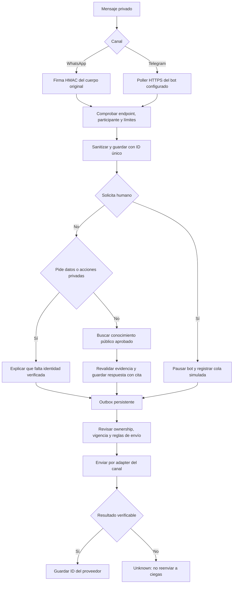
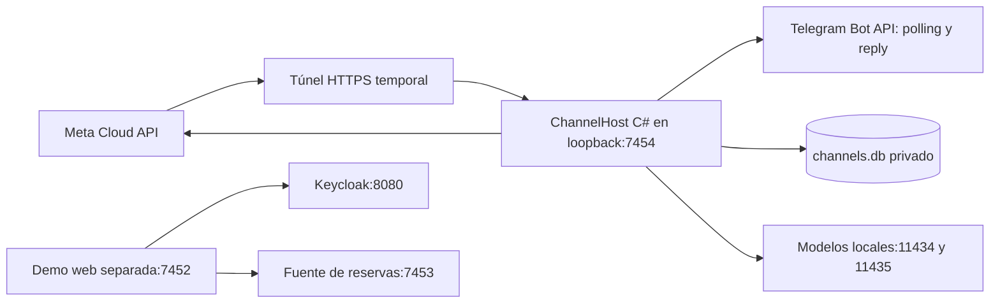
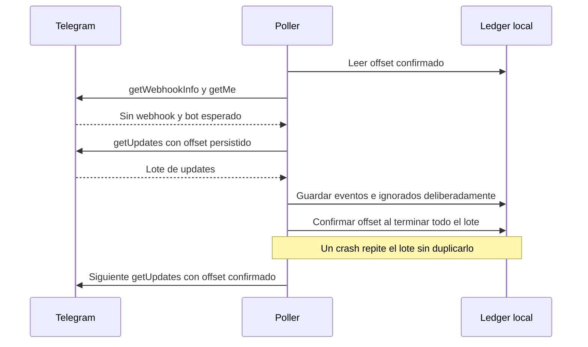
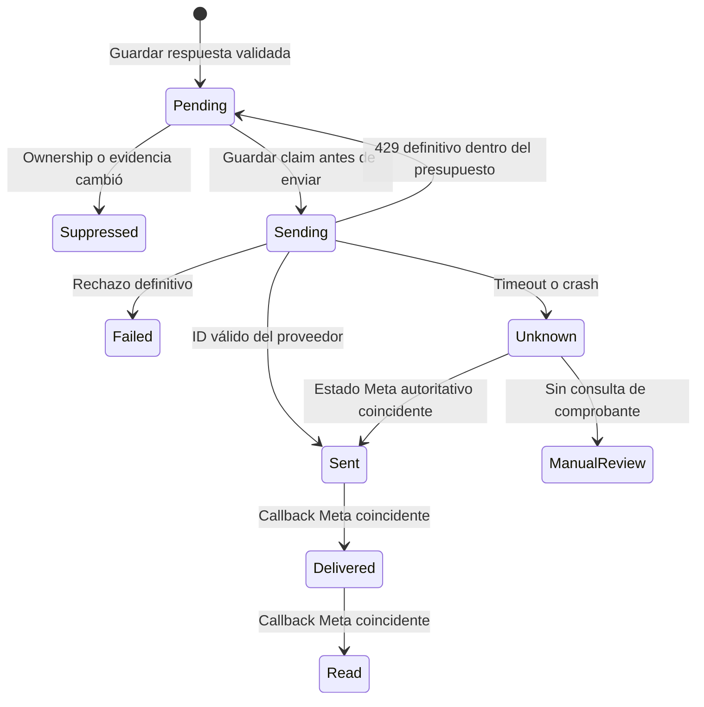

# WhatsApp y Telegram — arquitectura v0.11

[English y diagramas completos](channels.en.md) · [Freeze](../architecture-freeze-v0.11-channels.md) · [Contrato](../contracts/channels-v0.11.schema.json) · [ADR-024](../adr/024-demo-messaging-channels.md)

Fecha: 2026-10-01. Es la base de diseño para los canales nuevos. La demo web sigue en v0.10. El estado real de los adapters se registra por separado: este documento no demuestra por sí solo una conexión con Meta o Telegram.

## Qué vamos a agregar

Ambos canales recibirán texto privado y compartirán las reglas C# y los modelos locales. Telegram consultará la Bot API mediante long polling: no necesita publicar un receptor en Internet. WhatsApp usará Cloud API oficial con **número de prueba de Meta**, un receptor pequeño y un túnel HTTPS temporal.

El primer slice responderá preguntas públicas en ES/EN, explicará solicitudes no soportadas y registrará una petición de atención humana **simulada**. Controles explícitos: `/start`, `/es`, `/en`, `/human`. Quedan fuera grupos, medios, campañas, plantillas pagadas y escrituras de reservas.

El login y las reservas siguen disponibles en la demo web. El teléfono de WhatsApp o ID de Telegram no prueban que alguien sea dueño de una cuenta de miembro. Vincular cuentas será otro slice con prueba de control del canal y sesión OIDC confiable.

## Flujo principal

## Costo y preparación

| Pieza | Decisión | Condición |
|---|---|---|
| IA | Qwen/BGE-M3 fijados en el equipo | Sin fallback cloud, compra de hardware ni descarga automática |
| Telegram | Chat privado y mensajes normales | Token del bot y participantes permitidos; paid broadcast desactivado |
| WhatsApp | Número de prueba Meta | Confirmarlo en el panel; credenciales y participantes permitidos |
| HTTPS público | Quick Tunnel solo al puerto 7454 | Dirección temporal, sin SLA; actualizar callback si cambia |
| Persistencia | Archivo SQLite separado | Sin hosting pagado ni modificación de las bases existentes |
| Contact center | Interfaz neutral y mock | No se compra ni afirma integración Genesys real |

La meta es **sin cargos adicionales de servicios en esta configuración de demo**, no WhatsApp de producción gratuito. No se activan plantillas, campañas, paid broadcast, voz ni inferencia hospedada. Sin configuración o claves, el canal correspondiente queda apagado. No se automatiza WhatsApp Web ni se contrata un intermediario.

Fuentes oficiales comprobadas 2026-10-01: [Meta](https://whatsappbusiness.com/developers/developer-hub/), [firma de webhooks](https://whatsapp.github.io/WhatsApp-Nodejs-SDK/api-reference/webhooks/start/), [payloads Meta](https://www.postman.com/meta/whatsapp-business-platform/folder/tduohwq/webhook-payload-reference), [Bot API](https://core.telegram.org/bots/api), [FAQ Telegram](https://core.telegram.org/bots/faq), [túnel](https://developers.cloudflare.com/tunnel/get-started/quick-tunnels/), [Ollama local](https://docs.ollama.com/faq). Los términos cambian; revisar recursos de la cuenta sigue siendo condición de activación.

## Despliegue y responsabilidades

El túnel expone únicamente el host de canales. No expone demo web, cookies, callbacks de login, Keycloak, bases ni modelos. El receptor tiene solo rutas de verificación/webhook Meta y liveness sin contenido; la operación administrativa es CLI local. No acepta URLs arbitrarias ni sigue redirects al enviar claves.

Los parsers de cada proveedor producen un envelope neutral. Sus campos son canal, endpoint, evento, remitente, fechas y texto; ninguno concede identidad, rol, tenant o `MemberRef`. El endpoint configurado fija el tenant. Los DTOs de Meta/Telegram no entran a Domain/Application. El primer despliegue permite un worker por ledger y lo exige con bloqueo de proceso exclusivo.

Una pregunta pública utiliza contexto guest sin roles ni miembro. Solo puede leer conocimiento Public. Si el modelo propone consultar o cancelar reservas, se devuelve `VERIFIED_MEMBER_REQUIRED` sin contactar la fuente. Un ledger separado guarda idioma y ownership por remitente. El nuevo almacén copia el corpus sintético aprobado; no publica contenido nuevo en el almacén web existente.

## Requisitos y criterios

| ID | Requisito | Criterio verificable |
|---|---|---|
| CH-F01 | Normalización de texto privado | Pregunta equivalente de ambos fixtures llega al mismo handler |
| CH-F02 | Autenticidad y alcance Meta | HMAC ausente/incorrecto: 401; phone-number ID distinto no crea trabajo |
| CH-F03 | Offset Telegram persistente | Guardar lote antes de avanzar; replay tras crash no duplica trabajo |
| CH-F04 | Destinatarios y tamaño | Grupo, participante desconocido, medios y >2,000 caracteres Unicode no llaman IA |
| CH-F05 | Idioma y privacidad | `/en` persiste; secretos/email/teléfono se sanitizan; datos de pago se rechazan |
| CH-F06 | Autoridad del conocimiento | Guest no lee documentos Agent; revocado no se entrega |
| CH-F07 | Negar acciones privadas | Ni ID de canal ni número escrito llaman lectura/escritura de reservas |
| CH-F08 | Pausar por humano | Incrementar época antes de procesar; respuesta bot vieja queda obsoleta |
| CH-F09 | Incertidumbre de envío | Timeout pasa a Unknown; sin reenvío ciego |
| CH-F10 | Modo sin cargos | Sin templates, campañas, cloud ni paid broadcast; falta de configuración cierra canal |

Límites CH-N01–08, detallados también en la versión inglesa:

- Meta: cuerpo <=256 KiB, JSON depth 32, <=100 eventos; 60 requests/minuto; 100 mensajes aceptados/día por remitente y 1,000 globales. Comprobar allowlist antes de IA.
- 200 después de persistir o ignorar deliberadamente el lote; JSON inválido autenticado 400, falta de storage 503. Objetivo commit local <1 segundo, todavía por medir; webhook no espera inferencia.
- Ocho segundos compartidos por pregunta y un job de IA simultáneo. Sin reintentos ilimitados.
- Telegram: un poller, 25 segundos long polling, <=100 updates, tipos explícitos; no webhook simultáneo. Envío conservador global de uno por segundo. Reintentar solo 429 definitivo, respetando `retry_after`, máximo tres envíos.
- Respuesta plana <=3,500 caracteres Unicode, sin dividir automáticamente ni ejecutar markup. Cita por ID/versión/sección/título; sin links loopback inútiles desde el teléfono.
- Tokens, URLs con token, cuerpos originales, IDs de remitente y texto no van a logs/trazas. Guardar ruta necesaria y texto sanitizado en archivo local ignorado; errores devuelven códigos estables.
  Aclaración operativa, 2026-10-05: un rechazo definitivo de envío Meta puede registrar solo el estado HTTP y códigos/subcódigos numéricos. Nunca registrar mensajes de error del proveedor, detalles, trace IDs, cuerpos ni peticiones. Un fallo al leer el diagnóstico conserva Failed; no habilita reenvíos de Failed ni Unknown. Los fixtures deben comprobar esta restricción y la conservación del estado antes de activar el cambio.
- Objetivo retención siete días, tombstones de duplicados 30 días; verificar limpieza antes de activación real. Acceso OS restringido. SQLite no aporta por sí sola cifrado/compliance de producción.
- Preservar bases, cuentas, pins e informes v0.10. Evidencia nueva aislada.

## Entrada de WhatsApp

GET compara el verify token en tiempo constante y devuelve exactamente `hub.challenge`. POST verifica `X-Hub-Signature-256` con HMAC-SHA256 de los **bytes originales** y el app secret; el token de GET no autentica POST.

Después se comprueban endpoint, tipo y participante, se sanitiza y persiste por message ID. IDs repetidos con distinto hash normalizado pasan a `EVENT_CONFLICT` sin sobrescribir. Un fallo parcial permite replay seguro por claves únicas. Los callbacks de estado no crean preguntas ni bajan estados Delivered/Read a Sent.

La firma autentica que Meta entregó el evento; no autentica la cuenta de miembro del remitente.

## Entrada de Telegram

No usar `drop_pending_updates` automáticamente. Si existe webhook, detener con `TELEGRAM_WEBHOOK_CONFLICT`; el dueño decide quitarlo. Namespace por ID numérico del bot, no su token. IDs como enteros de 64 bits o strings decimales. Solo chats privados cuyo chat ID coincide con sender ID permitido. Ediciones y botones quedan fuera de v0.11.

## Entrega incierta y atención humana

La outbox evita perder una respuesta preparada, pero no se asume idempotencia de salida del proveedor. Si el envío quedó incierto, no se reenvía automáticamente. Telegram no permite buscar cualquier receipt por ID local de outbox; puede requerir operador. Se acepta una respuesta faltante para evitar duplicados visibles. La idempotencia de comandos de reservas es otra garantía distinta.

WhatsApp responde texto libre solo dentro de la ventana elegible de atención: fecha del mensaje autenticado, desvío futuro <=5 minutos y máximo 24 horas desde la última entrada válida del mismo remitente. No crea template de fallback. Revalidar ownership, cita y ventana justo antes de enviar. Un envío que ya salió no puede retirarse; no prometer eliminar esa carrera en todo instante.

Solicitar humano cambia BotOwned → HandoffPending e incrementa época antes de inferencia posterior. Solo aceptación mock del ID/época correctos pasa a HumanOwned. Los mensajes siguientes se guardan para el contexto simulado; `/start` no reactiva silenciosamente el bot. El slice muestra cola y pausa, no servicio humano real en el canal.

## Modelo de datos

El [ERD completo](channels.en.md#9-human-state-and-conceptual-data) relaciona ChannelConversation, InboundEvent, OutboundMessage, ChannelHandoff, ProviderEndpoint y PollCheckpoint.

Clave única inbox: `(canal, endpointId, eventId)`; eventId es update ID en Telegram y message ID en Meta. Ruta única: `(canal, endpointId, senderId)`; no se mezclan bots ni canales aunque coincidan IDs. Metadatos de ruta son datos privados. La respuesta conserva referencias de citas para revalidación. El offset avanza solo después de aceptación/rechazo durable del lote. La transferencia conserva ID y época inmutables.

## Amenazas y evaluación

| Amenaza | Control y prueba |
|---|---|
| Webhook falso | HMAC del cuerpo original; cambiar un byte falla |
| Endpoint, grupo o identidad falsa | Endpoint fijo, allowlist privada y roles=None; cero llamadas a fuente |
| Replay, desorden o crash | Unicidad persistente, hash conflictivo, estados monotónicos y restart |
| Prompt injection/documento malicioso | Propuestas cerradas y ACL Public; responder público no depende de fuente |
| Costo accidental | Modo explícito, sin templates/paid broadcast, cuotas; revisar cuerpos enviados |
| Secretos en trazas/excepciones | Logging de cliente desactivado/sanitizado y códigos estables; fixture inspecciona captura |
| Túnel abre producto local | Host dedicado, rutas permitidas, resto 404, sin cookies/admin público |
| Respuesta vieja tras handoff/revoke | Revisar época/evidencia al enviar; declarar límite de envío en vuelo |

Pruebas deterministas: payloads sintéticos firmados, HTTP falso del proveedor, SQLite aislada y clocks controlados. Cubrir parser real, headers, persistencia/offset, crash, envío Unknown, firma, allowlist, denegación privada, idioma, revocación y costo. No repetir 300 consultas de modelos para probar retrieval que no cambió.

Aceptación real aparte: una pregunta/respuesta ES y EN por canal, replay donde sea posible, token vencido, restart, solicitud humana y revisión del modo de costo. Guardar versión/canal/resultado sin payload, token ni teléfono. Telegram necesita token BotFather, ID de bot y participantes elegidos. Meta necesita app/número de prueba, app secret, access token, verify token, versión Graph y participantes.

## Orden y Definition of Ready

| Slice | Alcance | Condición |
|---|---|---|
| CH01 | Contratos, ledger y fixtures aislados | Freeze + negativos; pasar checks antes de activar |
| CH02 | Polling/reply Telegram privado | CH01 + config; mock antes de pareja live |
| CH03 | Webhook Meta firmado, test replies y túnel opcional | CH01 + API fijada + recursos test confirmados + claves |
| CH04 | Conocimiento público y handoff mock | CH01 + guest Public; checks de cita/época y storage independiente |
| CH05 | Vincular miembro y acciones críticas | **No Ready y excluido:** prueba dual autenticada, HTTPS y otro freeze |

Rollback: detener host/túnel y conservar demo web y bases originales. Mantener informes sanitizados. Cambiar webhook externo solo dentro de la configuración autorizada del dueño. No cambiar de modo web silenciosamente.

El DoR cierra el diseño de contratos/mock/público local. Credenciales, receipts reales, limpieza y modo de costo deben verificarse antes de anunciar integración live. No se compran servicios ni se migra producción.
