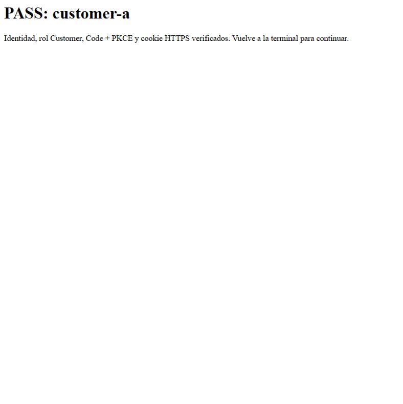
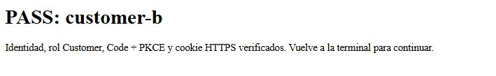

# B01 — Runtime, SQL e identidad local

Fecha: 2026-09-30. Estado: **CLOSED — compatibilidad verificada**. Architecture Freeze v0.1 permanece CLOSED. Build, SQL/OIDC y dos logins reales pasaron. El agente solicitó parada normal del diagnóstico mediante su run ID y comprobó una vez que el puerto 7443 dejó de escuchar. B02 puede iniciar su foundation bajo el DoR documentado. El código B01 permanece aislado en `spikes/`.

## Evidencia actual

| Check | Resultado y procedencia |
|---|---|
| SDK oficial | 10.0.401, runtime/ASP.NET 10.0.12, win-x64; SHA-512 oficial y ejecución local verificados por el agente |
| Restore y build | Locked restore y Release PASS, 0 warnings/0 errors |
| Offline | 12 checks PASS: runtime/SQL driver, Code+PKCE, cookie/mapping y JWT válido + cinco clases de token inválido |
| Docker Linux | Client/Server 27.4.0/API 1.47, desktop-linux, Linux/amd64; salida aportada por el usuario |
| SQL real | PASS desde la terminal del usuario: networking nativo, Encrypt Mandatory, IPv4 loopback; consulta confirma major 16.x / Developer. No se registró la versión exacta del parche |
| OIDC discovery real | Seis checks PASS desde la terminal del usuario: HTTP 200, issuer exacto, S256, JWKS restringido al issuer, claves disponibles y RSA |
| HTTPS sin sesión | PASS desde la terminal del usuario: `/proof` devuelve HTTP 401 con validación de certificado habilitada |
| Login customer-a | PASS en navegador operado por el agente: subject `10000000-0000-0000-0000-000000000001`, Customer, Code+PKCE S256 y regreso con cookie HTTPS |
| Login customer-b | PASS en navegador operado por el agente: subject `10000000-0000-0000-0000-000000000002`, Customer, Code+PKCE S256 y regreso con cookie HTTPS |
| Cookie y ticket | En ambas cuentas: atributos reales HttpOnly, Secure, SameSite=Lax; cookie regresó al middleware; ticket sin tokens guardados |
| Limpieza | Servidor detenido tras marcador de parada normal. Retirada del certificado en el perfil Windows original **no confirmada**, porque el usuario cerró el terminal. Se registra como nota operativa separada del gate de compatibilidad |
| Dependencias | 17 paquetes NuGet resueltos; hashes/lock contrastados; cero coincidencias en feed de advisories consultado. No es un escaneo del SO/SDK/capas Docker |

Son **19 checks de compatibilidad (12 offline y siete live), más dos logins reales**. No se presentan como evaluación del agente AI, pruebas de autorización de recursos o readiness productivo.

Evidencia: [registro de login](b01-login-evidence.json), [registro general](b01-evidence.json), [dependencias](b01-dependencies.json), [SDK](../../spikes/RuntimeCompatibility/sdk-evidence.json), [imágenes fijadas](../../deploy/local/image-lock.json).

## Verificación en navegador

El agente completó los dos logins en el navegador integrado de Codex contra el servidor diagnóstico que el usuario ya tenía abierto. Introdujo las credenciales existentes del fixture únicamente en Keycloak localhost y completó los perfiles ficticios Customer A/B con emails `@example.invalid`. Para B se reinició el formulario de login para seleccionar una identidad distinta de la sesión previa A.

El middleware observó Code+PKCE S256, callback exacto, código recibido, ID token validado por el handler, subject/Customer esperados, atributos reales de cookie y regreso HTTPS. El registro público se exportó después de comprobar ambas filas PASS y el mismo run ID del servidor. No contiene contraseñas, tokens, Set-Cookie ni mensajes arbitrarios del proveedor.

La exportación del agente conserva la procedencia del navegador y del preflight compartido por el usuario. El usuario cerró el terminal original; no se afirma que su finally retirara el certificado. El agente detuvo el servidor mediante el marcador del run ID y conservó la nota de retirada no confirmada.

## Corrección HTTPS en Windows

El primer intento del usuario falló antes del navegador; el helper retiró su certificado. En una reproducción instrumentada del servidor original, el agente observó Schannel `0x8009030E` con clave efímera. Microsoft documenta ese caso en [SslStream troubleshooting](https://learn.microsoft.com/en-us/dotnet/core/extensions/sslstream-troubleshooting#handshake-failed-with-ephemeral-keys).

El certificado ahora se recarga desde PKCS12 en memoria con `UserKeySet` en Windows, sin `PersistKeySet`. No se escribe PFX ni se cambia LocalMachine. La liberación del certificado elimina el contenedor temporal de clave según el [loader del runtime fijado](https://github.com/dotnet/runtime/blob/v10.0.12/src/libraries/System.Security.Cryptography/src/System/Security/Cryptography/X509Certificates/X509CertificateLoader.Windows.cs). El helper solicita parada normal mediante un marcador del run ID; si necesita Kill, informa que la limpieza de clave no está confirmada.

El usuario verificó HTTPS 401 con el cambio; el agente verificó los dos regresos HTTPS en navegador. El shell restringido del agente sigue sin poder importar esa clave Windows. Esta limitación no invalida el comportamiento observado del servidor iniciado por el usuario. Ver [historial diagnóstico](b01-https-diagnostic.json).

## Operación y siguiente slice

El helper conserva `.env` y volúmenes, detiene solo su servidor, retira solo su certificado y limpia su contraseña del portapapeles si sigue allí. El [runbook local](../../deploy/local/README.md) explica recuperación tras terminación forzada. No modificar ACL de Docker, publicar Docker por TCP ni desactivar TLS para sortear restricciones del agente.

Resource authorization, vinculación SQL, CSRF y revocación corresponden a B03. AC04 todavía no está satisfecho por producto. B02 se revisa con [DoR](../07-definition-of-ready.md): contratos OpenAPI del slice, skeleton API/Domain/Application/Infrastructure/Worker y pruebas de dependencias. No hay tablas/migraciones, RAG evaluado ni tenant Genesys probado.
