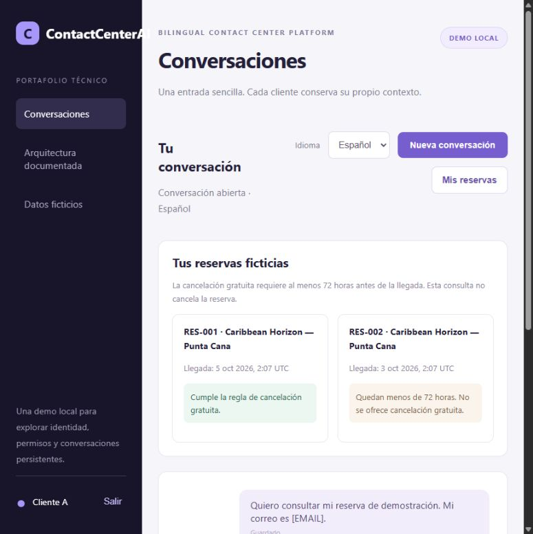
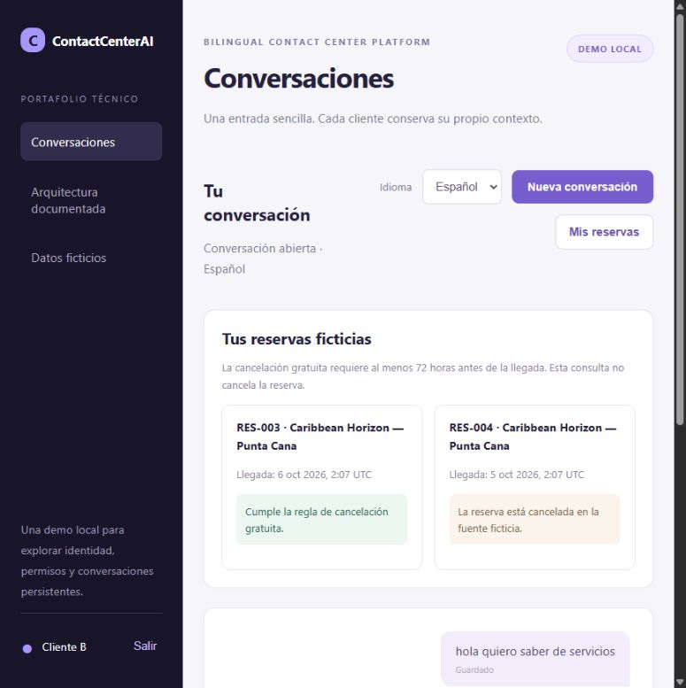

# B05 — Fuente de reservas y política determinista

Estado: **DONE dentro del perfil de presentación**, con consulta del producto/UI real. No cierra SQL Server, cancelación end-to-end ni recuperación de B06/B07. [Freeze previo v0.3](../architecture-freeze-v0.3-source.md), [ADR-015](../adr/015-source-simulator-demo.md).

DoR: FR05/08, CP-001 v1, AC11–14 en fuente, permisos de cliente, contrato HTTP, dos procesos/DB, clase pura de regla y source clock, autenticación interna automática, errores y replay definidos antes del código. AC15/16 requieren el workflow posterior del middleware.

Entregados: Simulator ASP.NET Core separado en loopback 7453; archivo SQLite fuente separado del operacional; adapter HTTP en Infrastructure; puerto neutral en Application; política pura en Domain. La fuente autoriza MemberRef delegado por el servicio, revalida versión/política/estado/clock, y confirma transición + receipt en una transacción. No se exponen credenciales fuente a browser/LLM ni se consulta su DB desde el middleware.

El producto agrega GET de reservas bajo una conversación autorizada de Customer. MemberRef deriva del binding servidor; no existe parámetro para elegir otro miembro. La UI muestra consulta informativa y elegibilidad, sin botón de cancelación ni oferta consumible. Los handlers de comando fuente son internos y todavía no se conectan al producto/worker.

| Evidencia | Alcance |
|---|---|
| [22 PASS](b05-source-evidence.json) | Regla exacta/offsets, ownership, fuente fuera de ventana, política/version stale, cien replays, doce comandos concurrentes/un efecto, receipt tras reapertura, clock de ejecución y Kestrel HTTP real con DB de prueba aislada |
| [Recorrido de navegador](demo-login-evidence.json) | Logins A/B reales, historial persistente sanitizado, A ve RES-001/002 y B RES-003/004; reglas visibles. No se afirma que navegación privada directa se haya comprobado |
| Build/regresión | Diez proyectos, Release cero warnings/errors; 33 checks de sesión/ingress anteriores pasan |
| Arranque real | API y Simulator independientes; lanzador carga las claves privadas y prepara ambos, datos previos conservados |

Fixtures de fuente se crean una sola vez: A tiene una reserva a +96 h y otra a +48 h; B tiene una a +120 h y otra previamente Cancelled. Se conservan entre reinicios y la regla usa la hora actual; no se adelantan silenciosamente fechas para mantenerlas elegibles. Las pruebas de cancelación usan una DB aislada y no modifican las reservas que ve el usuario.

Limitaciones: SQL Server fuente, TLS servicio-servicio, firma/claims de delegación empresarial, métricas/retención/HA y fallos distribuidos siguen pendientes. La clave común solo corresponde a usuarios ficticios; clave fuente aleatoria y estado no se empaquetan. El ledger guarda resultados Completed; no generalizar la garantía de NotFound de esta DB consistente a un proveedor externo. B06/B07 deben persistir oferta/confirmación/intención, controlar dispatch y convertir timeout posterior al envío en Unknown antes de habilitar cancelaciones del producto.

Reproducción: `eng/Invoke-SourceChecks.ps1` y `eng/Invoke-IngressChecks.ps1`; ejecutarlos con la demo detenida para no recompilar DLLs en uso. `eng/Start-Demo.ps1 -NoBrowser` arranca/reutiliza la presentación. El upgrade valida PID/executable/start time del marker antes de parar solo su API. No elimina bases, volúmenes, certificados ni procesos ajenos.

