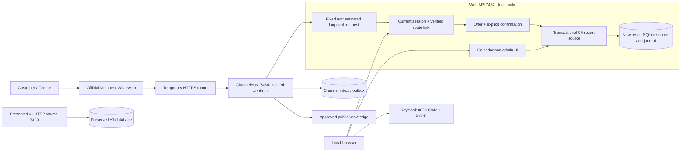

# Resort v0.12 delivery / Entrega

2026-10-06. Architecture-first review closed in [Freeze v0.12](../architecture-freeze-v0.12-resort.md) and the [executable contract](../contracts/resort-v0.12.md) before productive code.

Implemented / implementado: three categories with synthetic USD rates and amenities; live aggregate calendar; own stays; expiring booking/change/cancellation offers; explicit confirmation; integer money; unique unit/night allocations; atomic changes/cancellations and receipts; recoverable Queued commands; authenticated one-use browser/WhatsApp linkage; admin maintenance/rates; bilingual web UI and bounded channel parser. Fixed loopback bridge only; private web/login/admin routes are not tunneled.

## Local evidence

- Release build without warnings/errors; original regression: **332** deterministic checks passed, preserving the historical v0.10/v0.11 reports. New focused suite: **70** passed. Current combined deterministic coverage: **402** checks, from the regression plus the extended focused suite.
- [Resort checks](resort-v0.12-checks.json): real isolated SQLite concurrency, injected transaction failure and restart recovery, old booking preservation on conflict, 72-hour boundary, exact prices, replay, session/route/epoch authorization, account linking, encrypted pending link input and actual ASP.NET Core cookie/origin/CSRF/internal-key middleware. Includes create/change/cancel through the actual internal HTTP path with synthetic provider envelopes.
- [Python parser evaluation](../../evaluation/reports/resort-v0.12-parser.json): **28/28** declared ES/EN examples. Calls the compiled C# parser. This is a known example set, not a holdout or a live LLM evaluation. Previous **40** offline assistant evaluation cases also pass; historical real inference outputs/errors remain unchanged.
- Real local browser: Keycloak customer login; create a two-night/four-guest Suite quote (560 USD), confirm, change dates with zero fictional difference, then cancel. The original seed stays remain intact. No real charge.
- Real Meta/WhatsApp: owner sent the one-use linkage code and an availability query; live source alternatives/prices received. Same browser confirmed the pending linkage. Owner then confirmed a two-night Suite offer over WhatsApp. The authoritative CREATE_COMPLETED reply and own-booking response were supplied by the owner; the same confirmed stay was independently visible in the local browser. See [sanitized live observations](resort-whatsapp-2026-10-06.json). Live change/cancellation will be reported separately when observed; local HTTP fixtures are not provider evidence.

## Implementation topology

No extra remote source is used for this local resort. Queued command and atomic source booking/receipt transactions live in the new isolated database. A crash before completion leaves a queued ID to recover; a lost client response is an **unverified observation**, not a different durable source state. Source receipts remain authoritative. An expired/revoked session rejects unexecuted queued work; an already completed source transaction is not undone by later logout.

## Limits / límites

- Hotel/rates are fictional; no payments, campaigns or commercial inventory. One room per category, ninety-day horizon, one to fourteen nights. Search samples thirty arrival dates and returns up to five options; no stock holds.
- Current channel intent is simulated/deterministic. Local Qwen/BGE/RAG remains a separate profile, not activated by this resort launch. Catalog/inventory facts come from structured source, not vector text. Known phrase coverage is not general language fluency.
- Link is limited by the fifteen-minute verified session; expiry requires login/link again. Logout/principal-role checks are local operational checks on each request, not a claimed immediate push revocation from every external IdP system. An in-flight request accepted before a handoff/logout may complete; subsequent stale requests are denied.
- Pending link commands use AES-GCM and are cleared after completion. This does not imply the whole channel database is encrypted or that SQLite pages/provider histories are physically erased.
- Inventory administration stays local under OperationsAdmin. Telegram live bot is not configured. Human queue and Genesys remain mocked; live Genesys, encrypted SQL product gate, independent evaluation/security and remote CI remain open.
- GitHub Actions includes the new checks/evaluation, but a remote run is not claimed. The prior account/platform runner restriction remains separate from successful local tests.

En español: el resort está implementado y las reglas se comprobaron con almacenamiento y HTTP reales locales. La consulta de disponibilidad y la creación confirmada de una Suite ya se vieron por WhatsApp real. La evidencia de operaciones privadas en Meta se distingue de las pruebas aisladas. El bot de este perfil usa intenciones acotadas, hotel/precios ficticios y cola humana simulada. No se presenta como sistema de producción.
