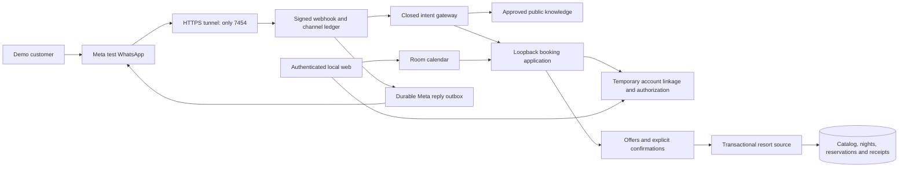
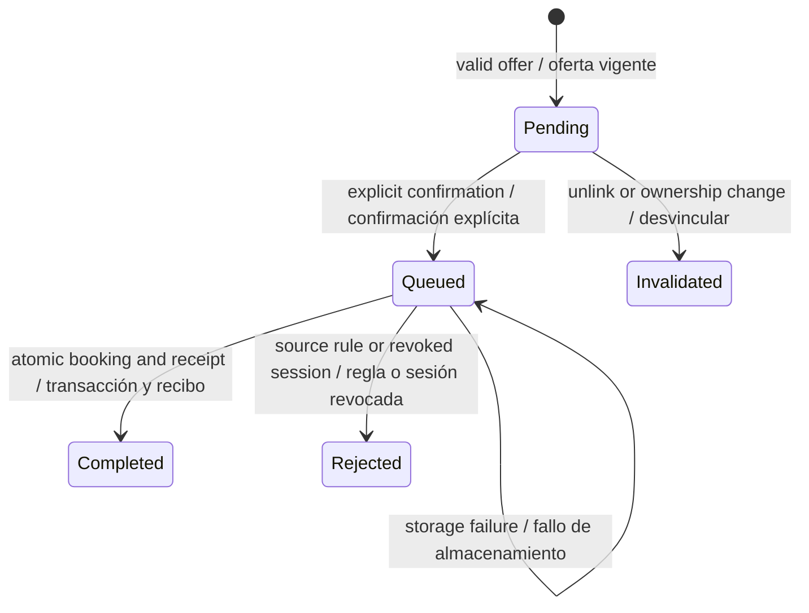
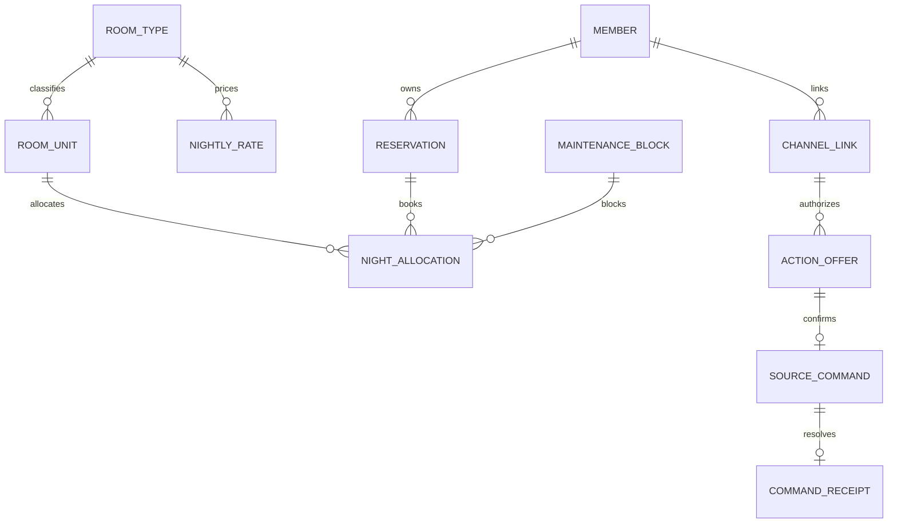

# Resort calendar and WhatsApp booking — v0.12 architecture

Date: 2026-10-06. Status: **local baseline closed and implemented**. See [delivery evidence](progress/resort-v0.12.md). The final executable contract supersedes the original topology sketch. [Español](resort-booking-v0.12.es.md) · [ADR-025](adr/025-resort-booking-calendar.md) · [Closed freeze](architecture-freeze-v0.12-resort.md).

## Purpose and boundaries

Expand the fictional hotel demo from public questions to room/amenity/rate search, live available dates, new reservations, own-reservation lookup, date/category changes and cancellation through WhatsApp. A local calendar supports occupancy and maintenance administration. All bookings and rates are synthetic; there are no real payments or commercial hotel connections.

The owner confirmed a hotel scenario and requested accommodation categories, prices and amenities such as a jacuzzi. Implemented seed (logical unit labels):

| Unit | Category | Guests | Fictional nightly rate | Amenities |
|---|---|---:|---:|---|
| R101 | Standard | 2 | USD 120 | Wi-Fi, breakfast, air conditioning |
| R201 | Deluxe | 2 | USD 180 | Wi-Fi, breakfast, balcony, pool view |
| R301 | Suite | 4 | USD 280 | Wi-Fi, breakfast, balcony, pool view, private jacuzzi, terrace |

One unit per category makes sold-out categories visible. Rates include every component of this simplified simulation, without representing commercial taxes. Total is the sum of nightly rates. Category changes show previous total, new total and fictional difference. No payments, refunds, deposits, charged penalties or commercial discounts. Exclude multi-property/multi-currency pricing, campaigns, voice, third-party bookings, phone-derived admin roles and live Genesys. Telegram has a separate activation gate.

## Information and authority

Policies use governed bilingual knowledge with references. Catalog/amenities/rates use a versioned structured source. Available dates query current inventory with a read timestamp. Own reservations require a verified linkage and server-side ownership filtering. C# application rules and source transactions control writes. A model may propose an intent and filters; it cannot authorize, price, allocate or report success without source facts. Inventory never becomes authoritative vector-index text.



## Calendar and price rules

- Property zone `America/Santo_Domingo`; check-in 15:00/check-out 11:00. Hotel nights use `[arrival, departure)`, allowing same-day checkout/next arrival. PC timezone cannot redefine inventory.
- Search horizon 90 days, stays 1–14 nights, positive guests within unit capacity, no past nights. Ambiguous/incomplete dates trigger clarification and a full-date confirmation summary.
- The **same unit** must be free for every requested night. Unique `(unitId, night)` allocations cover both reservations and maintenance. Transactional source enforcement determines the winner of concurrent confirmations.
- Five-minute quotes do not hold inventory. Confirm rechecks all nights, capacity, policy, identity and rate/catalog versions.
- Money is integer minor units in fixed USD; checked totals from the fixed nightly rate and night count. A price/version change requires a new offer.
- Cancellation retains CP-001: at least 72 hours before current arrival. Proposed RS-001 changes also require 72 hours before the **existing** arrival and future target dates; moving the date cannot evade policy.
- Reschedule is atomic: verify target nights before releasing original nights; exclude own overlapping allocations from foreign occupancy. A conflict keeps the old booking intact.
- Cancellation releases nights and records the receipt in one transaction, preserving history.
- Verified OperationsAdmin can create/remove versioned maintenance blocks on free nights. Blocking cannot silently evict a reservation or remove another type of allocation.
- Versioned seeds initialize once from a persisted anchor date; include free, occupied and maintenance nights. Restart never moves dates or recreates cancelled stays. Scenario renewal is explicit with a prior backup.

## Account linkage

Catalog, prices and availability are public. Private operations require a one-time setup from the local web demo:

1. Customer signs in through Keycloak and requests a WhatsApp link.
2. Generate a single-use random code with at least 128 bits, hash-only storage and five-minute expiry. Bind it to the authenticated account/session and fixed provider endpoint. Exclude codes from model input and logs.
3. Customer submits the code from the signed/allowlisted WhatsApp route. An authenticated internal service creates a pending link.
4. The same local web session confirms the masked route before activation. A link lasts at most 30 minutes and never outlives its session.
5. Logout, expiry or revocation invalidate the link and pending offers. Every confirmation checks current authority; failed verification prevents action.

The phone number, typed member ID or reservation ID grants no identity. Never ask for a password in chat. Link setup uses the PC; do not send a phone user an unusable localhost login link. Remote login needs another HTTPS hosting design. Internal API uses its own service credential, fixed routes and no redirects; service authentication is not customer authorization. Web, identity, source and internal APIs stay outside the public tunnel. ChannelHost does not read the web operational database directly.

## Confirmation, transactions and uncertainty

```mermaid
sequenceDiagram
    participant U as WhatsApp customer
    participant C as ChannelHost
    participant A as Booking application
    participant S as Resort source
    U->>C: Suite, October 20 to 22, two guests
    C->>A: Structured proposal and route
    A->>A: Verify link, capacity and full dates
    A->>S: Current availability and nightly rates
    S-->>A: Available, versions, fictional USD 560
    A-->>C: Five-minute offer with exact payload and reference
    C-->>U: Summary and offer-bound confirmation command
    U->>C: Confirm offer reference
    C->>A: Confirmation bound to account, route and epoch
    A->>A: Consume once and commit durable command
    A->>S: Same commandId with expected versions
    S->>S: Validate and atomically save allocations, booking and receipt
    S-->>A: Completed receipt or conflict
    A-->>C: Authoritative result
    C-->>U: Confirmed booking or stable rejection; customer may search again
```



A queued command survives restart and is recovered with the same ID. Source state and receipt commit together. A lost HTTP response is an unverified client observation: query that command's receipt or own bookings rather than create another booking. Pending offer expiry is checked from its deadline; Expired is not a stored state. Unknown in the independent Meta outbox describes message delivery. WhatsApp delivery is separate from business completion. An uncertain reply does not undo a completed reservation; own-reservation lookup returns source state.

## Data and compatibility



Allocation belongs to exactly one booking or maintenance block. Version entities; bind offers to payload hash/account/route/epoch/expiry and source versions; current static CP-001/RS-001 rules are rechecked. Unique command receipt includes account and payload hash: same command returns the same result, changed payload conflicts. Audit semantic events without public message text, phone or secrets.

An isolated `resort-v0.12` source/workflow profile uses one new SQLite source/journal/link store inside the web API, per the [final contract](contracts/resort-v0.12.md). Its v2 contracts add checkout, unit, guests and total. Keep v1 source/web databases and measurements intact, distinguish new `STAY-...` IDs from historical `RES-...`, and retain channel inbox/outbox history. UI identifies the active scenario. Never invent checkout dates in v1 records or combine sources for a booking. Rollback returns to public FAQ without deleting new receipts/databases or concealing uncertain commands.

## Acceptance and delivery

RB01–16 are specified with examples in the [Spanish packet](resort-booking-v0.12.es.md): missing search dates, Suite/amenity filtering, exact two-night quote, last-unit concurrency, intermediate occupied night, failed/successful atomic change, 72-hour boundary, cross-account access, expired/altered offer, duplicate confirmation, lost source receipt, admin authorization, code/session lifecycle, bilingual control and handoff epoch invalidation.

Threat controls cover stale inventory, wrong date extraction, hijacked links, double occupancy and partial changes. Isolated deterministic tests exercise real SQLite concurrency, date boundaries, integer prices, authority, replay and recovery. Python evaluates bilingual extraction separately from authorization and source correctness; simulator and local-model outcomes are distinct. Keep historical RAG results. Metrics use stable conflict/expiry/authority/policy/uncertainty codes without PII. A local query target under one second is a goal, not a measured claim.

Order: close contracts/freeze → source/catalog/inventory → authenticated calendar admin → account linkage → booking/change/cancel offers and receipts → WhatsApp ES/EN live tests → bilingual documentation and short video. Required regression runs are scoped to changed invariants; remote CI restrictions remain explicit.

DoR requires versioned API/schema/error contracts, implementable session revocation bridge, negative oracles, date-parser boundaries, confirmation UI, compatibility review and disabled feature flag. **DoR closed before code in the executable contract and Architecture Freeze. Private actions now require verified linkage.** DoD requires no cross-account/double-booking failure, tested persistence/reconciliation, real ES/EN channel operations, calendar/source agreement, clear synthetic prices and secret-free evidence.

Portfolio video: Suite/jacuzzi → unavailable dates → alternative → USD 560 fictional two-night quote → explicit confirmation → calendar update → reschedule → eligible cancellation → nights available again. Label fictional hotel/rates, real WhatsApp transport, actual AI mode and simulated human transfer. Present measured outcomes, not this plan as implemented.
