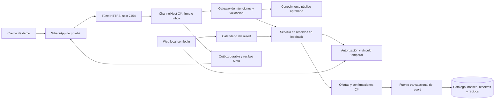
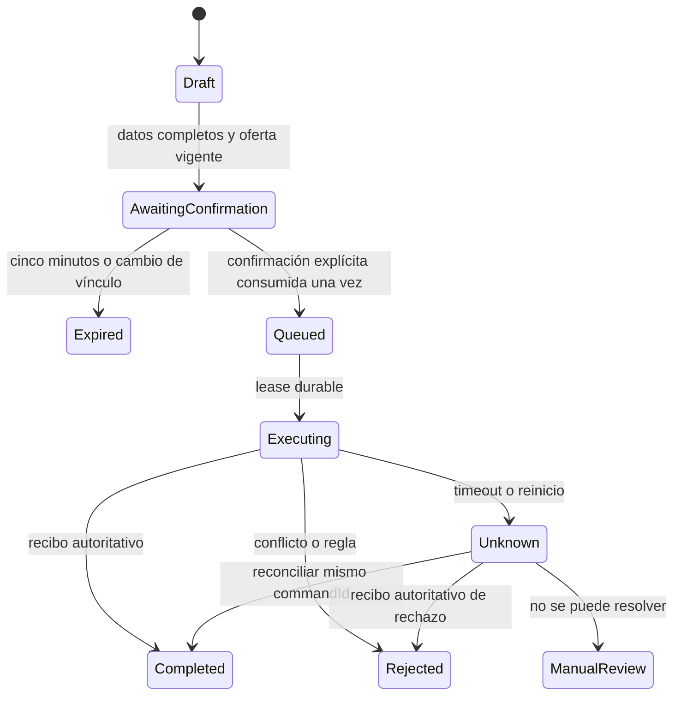
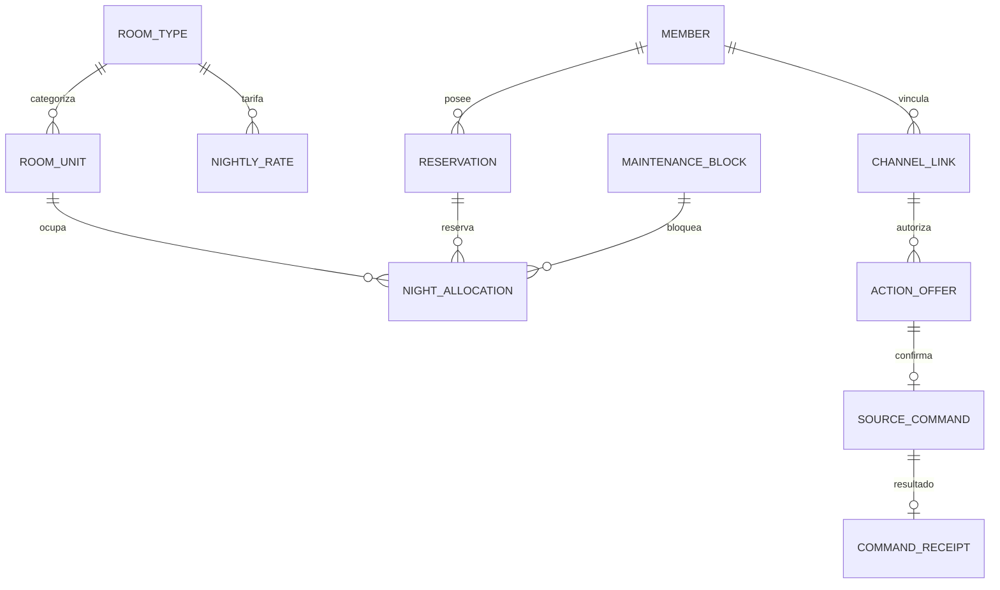

# Calendario y reservas por WhatsApp — propuesta v0.12

Fecha: 2026-10-06. Estado: **diseño propuesto, sin implementación**. [English](resort-booking-v0.12.en.md) · [ADR-025](adr/025-resort-booking-calendar.md) · [Freeze](architecture-freeze-v0.12-resort.md).

## Objetivo y alcance

Convertir la demo de preguntas públicas en una experiencia de reservas de un resort ficticio: consultar habitaciones, amenidades, tarifas y fechas; crear una estancia; consultar, cambiar o cancelar reservas propias desde WhatsApp. Una vista de calendario permite gestionar ocupación y mantenimiento. Son datos y precios ficticios, sin pagos reales ni conexión a un hotel comercial.

El usuario confirmó el escenario de hotel y pidió categorías de estadía, precios y amenidades. El catálogo inicial propuesto es editable antes de cerrar el diseño:

| Unidad | Categoría | Capacidad | Tarifa ficticia por noche | Amenidades |
|---|---|---:|---:|---|
| R101 | Estándar | 2 | USD 120 | Wi-Fi, desayuno, aire acondicionado |
| R201 | Deluxe | 2 | USD 180 | Lo anterior, balcón y vista a piscina |
| R301 | Suite | 4 | USD 280 | Lo anterior, jacuzzi privado y terraza |

Una unidad por categoría permite mostrar que una Suite puede estar ocupada mientras la Estándar está libre. La tarifa incluye todos los conceptos de esta simulación; no representa impuestos ni tarifas comerciales. Total = suma de tarifas de las noches. No hay descuentos, anticipos, pagos, penalidades cobradas o reembolsos. Cambiar de categoría muestra total anterior, nuevo total y diferencia como información ficticia.

Fuera de alcance: múltiples hoteles, múltiples monedas, precios dinámicos comerciales, pasarela de pago, campañas, voz, reservas de terceros, permisos administrativos inferidos del teléfono y Genesys real. Telegram conserva su gate propio.

## De dónde sale cada respuesta

| Información | Fuente | Regla |
|---|---|---|
| Políticas y explicaciones | Conocimiento aprobado ES/EN | RAG con versión y referencia |
| Categorías, amenidades y tarifas | Catálogo estructurado versionado | Consulta del servicio; no inventar precios |
| Fechas libres y ocupadas | Inventario vigente de la fuente | Consulta en vivo con fecha/hora de lectura |
| Reservas del cliente | Fuente, mediante identidad vinculada | Filtrar por dueño en servidor |
| Crear, cambiar y cancelar | Casos de uso C# + transacción de fuente | Oferta, confirmación y recibo obligatorio |

La IA identifica intención y propone filtros. C# valida fechas, capacidad, identidad, precios, propiedad y estados. El calendario no se almacena como texto en el índice vectorial: ese texto quedaría desactualizado tras una reserva.

## Reglas de calendario y precios

- Estancias por noches: intervalo `[entrada, salida)`. Salir el día 12 permite otra entrada el día 12.
- Zona de la propiedad: `America/Santo_Domingo`; entrada 15:00, salida 11:00. Fechas `YYYY-MM-DD`, presentación ES/EN. La zona del PC no decide la noche hotelera.
- Horizonte inicial: 90 días; entre 1 y 14 noches; huéspedes positivos y dentro de la capacidad. No se reservan noches pasadas. Fechas incompletas o ambiguas requieren aclaración y resumen con fechas completas.
- La unidad elegida debe estar libre durante **todas** las noches. No basta con que exista alguna habitación libre por noche si no es la misma unidad.
- Una clave única `(unitId, night)` protege reserva y mantenimiento. Fuente transaccional: dos clientes compitiendo por la última Suite producen un éxito y un conflicto.
- Cotización válida 5 minutos, sin retener inventario. Consultar o preparar una oferta no garantiza disponibilidad; se revalida al confirmar.
- Dinero en centavos enteros y moneda fija USD, sin `float`. La oferta contiene desglose por noche, versiones y total. Cambio de tarifa antes de confirmar requiere oferta nueva.
- Cancelación CP-001: al menos 72 horas antes de la entrada. Cambio gratuito RS-001: también exige 72 horas respecto de la **entrada actual**, y nuevas fechas futuras; mover la fecha no evade la política.
- Cambio atómico: validar nueva disponibilidad antes de liberar las noches actuales. Un conflicto conserva toda la reserva anterior. Un cambio que se solapa con noches propias no las considera ocupación ajena.
- Cancelar libera noches en la misma transacción que el recibo. El historial permanece.
- Mantenimiento solo para `OperationsAdmin` verificado: bloquear fechas libres o retirar un bloqueo propio/versionado. No puede borrar ocupación ni cancelar reservas ajenas silenciosamente.
- Semilla versionada de ejemplo: generar una vez respecto de una fecha base guardada, con noches libres, ocupadas y mantenimiento. Reiniciar no mueve las reservas al futuro ni repuebla lo cancelado. Renovar el escenario exige acción explícita con copia previa.

## Identidad sencilla sin confiar en el teléfono

Disponibilidad, catálogo y precios son públicos. Para reservas propias se vincula una cuenta ficticia una vez:

1. El cliente inicia sesión en la web local mediante Keycloak y elige «Vincular WhatsApp».
2. Se genera un código de un uso, aleatorio de al menos 128 bits, con 5 minutos de vigencia; se guarda solo su hash. Está limitado a la cuenta, sesión, canal y endpoint configurados. No se registra en logs ni se envía al LLM.
3. El cliente envía el código al bot. El webhook firmado demuestra control de la ruta de canal; una API interna autenticada registra una vinculación pendiente.
4. La misma sesión web muestra la ruta enmascarada y confirma la vinculación. Solo entonces se crea un permiso temporal para las reservas de ese cliente ficticio, con máximo 30 minutos y limitado por la vigencia de la sesión.
5. Expiración, logout o revocación invalidan el vínculo y las ofertas pendientes. Cada confirmación vuelve a comprobar la sesión/permiso; fallo de la comprobación impide la operación.

Después de esa vinculación, las operaciones ocurren por WhatsApp. La identidad nunca viene del texto, número de reserva o teléfono. No se pide la contraseña por chat. Web, Keycloak y API interna quedan en loopback; el móvil no recibe un enlace localhost inutilizable. Vincular se realiza en el PC de la demo. Una experiencia remota completa necesitaría otro diseño de hosting HTTPS.

## Arquitectura y límites



La API interna tiene una credencial de servicio distinta del token Meta y de la clave de fuente, rutas fijas y sin redirecciones. La autenticación del servicio no autoriza por sí sola al cliente: cada operación requiere vínculo vigente. El ChannelHost no abre directamente la base operacional web. Ninguna ruta de login, administración o reserva HTTP queda en el túnel público.

El perfil nuevo `resort-v0.12` usa bases nuevas para fuente y workflow, conserva inbox/outbox históricos de canales y distingue códigos `STAY-...` de los `RES-...` históricos. Los endpoints v1 y mediciones v0.10 permanecen. La pantalla indica qué escenario está activo; nunca combina inventario de dos fuentes para la misma reserva. El contrato v2 añade salida, unidad, huéspedes y total; no rellena una salida inventada en las reservas v1.

## Flujo de reserva o cambio

```mermaid
sequenceDiagram
    participant U as Cliente WhatsApp
    participant C as ChannelHost
    participant B as Aplicación C#
    participant S as Fuente resort
    U->>C: Reservar Suite del 20 al 22 de octubre para 2
    C->>B: Intención estructurada + ruta
    B->>B: Verificar vínculo, fechas y capacidad
    B->>S: Consultar noches y tarifas actuales
    S-->>B: Disponible, versiones, USD 560 ficticios
    B-->>C: Oferta de 5 minutos; fechas, total y referencia
    C-->>U: Resumen y comando de confirmación de esa oferta
    U->>C: Confirmar referencia de oferta
    C->>B: Confirmación ligada a cuenta, ruta y época
    B->>B: Consumir oferta una vez y persistir comando
    B->>S: Ejecutar commandId con versiones esperadas
    S->>S: Revalidar y guardar noches, reserva y recibo atómicamente
    S-->>B: Recibo Completed o conflicto
    B-->>C: Resultado basado en recibo
    C-->>U: Reserva confirmada o propuesta de alternativas
```

Si la fuente confirma pero se pierde la respuesta, el comando queda `Unknown`. Consultar recibo con el mismo commandId; no crear una segunda reserva. La entrega de WhatsApp es independiente: una reserva puede estar completada aunque su mensaje tenga resultado incierto. Consultar «mis reservas» recupera el estado real.



## Modelo conceptual



Cada asignación pertenece a una reserva **o** un bloqueo, nunca a ambos. Entidades con versión; oferta con hash de payload, cuenta/ruta/época, vencimiento y política. Recibo único por commandId, con hash de payload y cuenta. Repetir el mismo comando devuelve el mismo resultado; otro payload con ese ID produce conflicto. Registrar eventos de reserva/cambio/cancelación/bloqueo sin textos, claves o teléfono en trazas públicas.

## Requisitos y aceptación

| ID | Caso | Resultado comprobable |
|---|---|---|
| RB01 | «Dame las fechas disponibles para reservar» | Pedir categoría, mes y duración que falten; devolver rangos continuos consultados en fuente |
| RB02 | «Quiero una Suite con jacuzzi» | Catálogo versionado, capacidad y tarifa ficticia; preguntar fechas |
| RB03 | Estancia de dos noches | Total exacto de ambas tarifas y confirmación antes de escribir |
| RB04 | Dos clientes confirman la última Suite | Una reserva; el otro recibe conflicto y alternativas |
| RB05 | Noche ocupada o mantenimiento intermedio | No ofrecer ese intervalo; devolver alternativas que sí caben completas |
| RB06 | Cambiar reserva a fechas ocupadas | Reserva y noches anteriores intactas |
| RB07 | Cambiar tipo o fechas disponibles | Nuevo total y diferencia; confirmar; sustitución atómica |
| RB08 | Cancelar a 72 h / a menos de 72 h | Permitido en límite exacto; rechazado por debajo; sin cobro ficticio automático |
| RB09 | Otro remitente conoce un código STAY | No leer ni cambiar la reserva; respuesta genérica |
| RB10 | Oferta expirada, antigua, ajena o precio cambiado | Ninguna escritura; cotizar de nuevo cuando corresponda |
| RB11 | Webhook repetido o confirmación duplicada | Un comando y un recibo; sin doble reserva |
| RB12 | Commit fuente + timeout / reinicio | Unknown y reconciliación del mismo comando; no repetir efectos |
| RB13 | Cliente intenta bloquear calendario | Denegado; OperationsAdmin solo con identidad verificada |
| RB14 | Código de vínculo repetido, expirado o sesión cerrada | Sin nueva autoridad; invalidar ofertas afectadas |
| RB15 | ES/EN y «háblame en español» | Idioma persistido mediante regla acotada; no modifica identidad ni reserva |
| RB16 | Handoff durante confirmación pendiente | Época invalida oferta; ningún nuevo comando tras perder ownership |

## Riesgos, evaluación y entrega

Pruebas deterministas primero: concurrencia en fuente real SQLite aislada, bordes de fecha/zona, precios enteros, vínculo cruzado, replays, expiración, recuperación y roles. Evaluación Python de frases ES/EN para extracción; separar sintaxis válida de intención correcta y de operación autorizada. La cobertura del parser simulado y del modelo local se reporta por separado; no declarar conversación natural general a partir de frases conocidas. No repetir mediciones RAG históricas para validar el calendario.

Observabilidad: códigos estables para conflicto de inventario, oferta caducada, vínculo inválido, política y resultado incierto; métricas de ofertas/comandos/recibos y latencia sin PII. Disponibilidad caducada, extracción errónea, secuestro de vínculo, doble asignación y cambio parcial son amenazas con los controles anteriores. Objetivo local de consulta <1 s sin LLM; es objetivo, no medición.

Orden: (1) cerrar reglas/contratos y freeze; (2) fuente, catálogo, calendario y concurrencia; (3) UI local de calendario y OperationsAdmin; (4) vínculo de cuenta; (5) ofertas/confirmación/recibos de reserva, cambio y cancelación; (6) WhatsApp, frases ES/EN y pruebas reales; (7) documentación y video. CI conserva invariantes; ejecutar regresiones pertinentes y reportar por separado cualquier runner remoto bloqueado.

Definition of Ready: contratos versionados de búsqueda/cotización/comando/recibo y vínculo; esquema y restricciones; impacto sobre v1; casos negativos con oráculos; límites de parser; UI de confirmación; rollback y feature flag desactivado. **El paquete es una propuesta; todavía no cierra estos puntos ni habilita acciones privadas en el host actual.**

Definition of Done: suites pertinentes pasan; no doble ocupación ni acceso cruzado; persistencia/reconciliación demostradas; operaciones ES/EN vistas en WhatsApp con recibos; calendario refleja el estado de la fuente; precios ficticios visibles; artefactos sin secretos y límites documentados. Rollback desactiva v0.12 y vuelve al FAQ v0.11 conservando bases y recibos, incluso comandos inciertos pendientes de revisión.

Guion de video: Suite/jacuzzi → fechas ocupadas → alternativa → USD 560 por dos noches → confirmar → calendario actualizado → cambiar fechas → cancelar elegible → noches libres. Mostrar que el último cupo no se duplica. Rotular «hotel y tarifas ficticias, WhatsApp real, modo IA usado y transferencia simulada»; publicar resultados comprobados, no este plan como si estuviera implementado.
